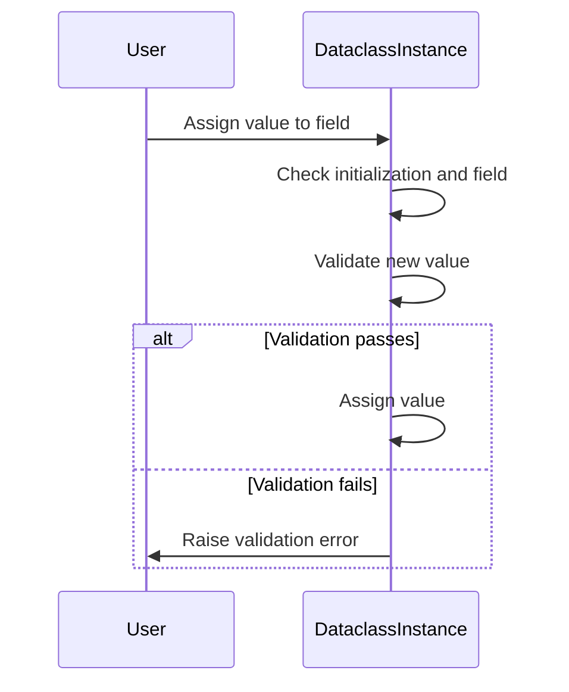
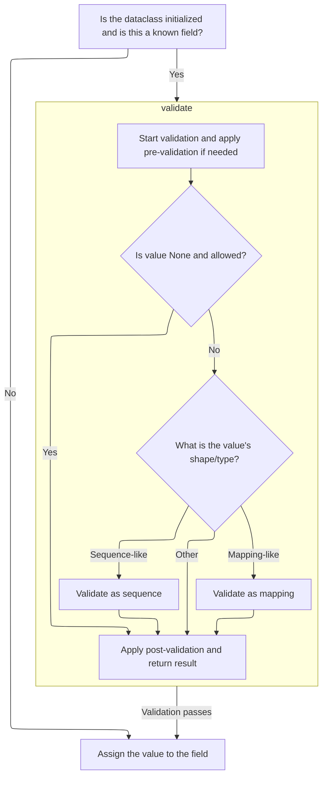
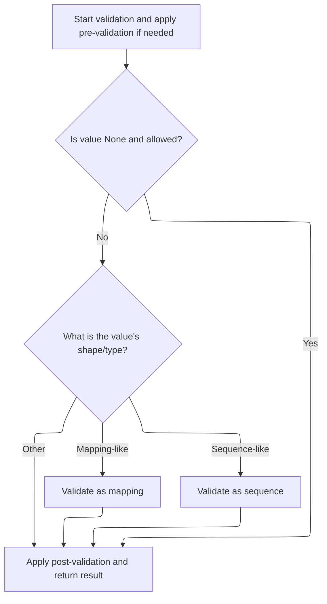
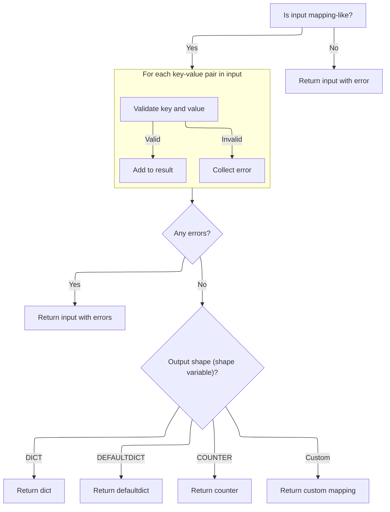
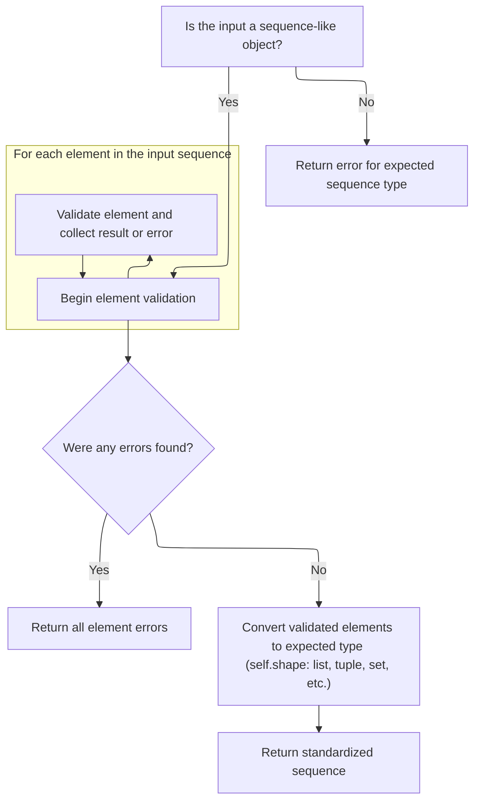

This document explains how attribute assignments to dataclass fields are validated before being set. When a value is assigned, the system checks if the dataclass is initialized and the field is recognized, then validates the value against the field's type and constraints. If validation passes, the value is assigned; otherwise, a validation error is raised.

The main steps are:

- Check dataclass initialization and field recognition
- Validate the new value
- Assign the value if validation passes
- Raise an error if validation fails



# Spec

## Detailed View of the Program's Functionality

a. Intercepting Attribute Assignment in Dataclasses

When an attribute is assigned on a Pydantic dataclass, the assignment is intercepted to ensure that the value being set is valid according to the field's type and constraints. The interception logic first checks if the dataclass instance has already been initialized (<SwmToken path="pydantic/v1/dataclasses.py" pos="485:32:34" line-data="    which won&#39;t be a superset of all the dataclass fields (only the stdlib fields i.e. &#39;x&#39;)">`i.e`</SwmToken>., it has passed initial validation). If so, it prepares a dictionary of the current attributes, excluding the one being set, and looks up the field definition in the model. If the field is recognized (<SwmToken path="pydantic/v1/dataclasses.py" pos="485:32:34" line-data="    which won&#39;t be a superset of all the dataclass fields (only the stdlib fields i.e. &#39;x&#39;)">`i.e`</SwmToken>., it is a known field), the new value is validated in the context of the current state of the dataclass. If validation fails, a validation error is raised. If the field is not recognized or the dataclass is not initialized, the value is simply assigned without validation.

b. Field Value Validation Entry Point

The validation process for a field value begins by checking for special cases such as deferred types or forward references. If the field has pre-validators, these are applied first. If any pre-validator fails, the process returns immediately with the error. If the value is `None`, the logic checks if `None` is allowed for this field. If allowed, post-validators are applied if present; otherwise, `None` is accepted as valid. If `None` is not allowed, a specific error is returned.

If the value is not `None`, the validation logic proceeds based on the expected shape of the field:

- For singleton fields (simple types or unions), it delegates to a specialized singleton validation function.
- For mapping-like fields (such as dictionaries), it delegates to mapping validation.
- For tuples, iterables, generics, or <SwmToken path="pydantic/v1/fields.py" pos="902:3:5" line-data="        Validate sequence-like containers: lists, tuples, sets and generators">`sequence-like`</SwmToken> containers, it delegates to the appropriate validation function for each type.

After the main validation, if there are no errors and post-validators are defined, these are applied as a final step.

c. Validating Singleton Fields (Including Unions)

For singleton fields, if the field is a union (<SwmToken path="pydantic/v1/dataclasses.py" pos="485:32:34" line-data="    which won&#39;t be a superset of all the dataclass fields (only the stdlib fields i.e. &#39;x&#39;)">`i.e`</SwmToken>., it can accept multiple types), the validation logic tries several strategies:

- If a discriminator is defined, it uses discriminated union logic.
- If "smart union" is enabled, it first checks for an exact type match, then for a subclass match, and finally tries to coerce the value into one of the allowed types by recursively validating against each subfield.
- If none of the subfields match, it collects all errors and returns them.
- If the field is not a union, it simply applies the field's validators.

d. Validating Mapping-Like Structures

When validating mapping-like fields (such as dictionaries), the logic first checks if the input is a valid mapping. If not, it returns an error. For each key-value pair in the mapping:

- The key is validated using the key field's validation logic.
- If the key is invalid, the error is collected and the value is skipped.
- If the key is valid, the value is validated using singleton validation.
- If the value is invalid, the error is collected.
- If both key and value are valid, the result is added to the output mapping.

After processing all items, if any errors were collected, they are returned. Otherwise, the validated mapping is returned in the appropriate container type (dict, defaultdict, counter, or a custom mapping type).

e. Handling Other Collection Types in Validation

For other collection types, the validation logic checks the expected structure (tuple, iterable, generic, <SwmToken path="pydantic/v1/fields.py" pos="902:3:5" line-data="        Validate sequence-like containers: lists, tuples, sets and generators">`sequence-like`</SwmToken>, etc.) and delegates to the corresponding validation function. For <SwmToken path="pydantic/v1/fields.py" pos="902:3:5" line-data="        Validate sequence-like containers: lists, tuples, sets and generators">`sequence-like`</SwmToken> containers (lists, sets, etc.), it validates each element individually.

f. Validating Sequence-Like Containers

For <SwmToken path="pydantic/v1/fields.py" pos="902:3:5" line-data="        Validate sequence-like containers: lists, tuples, sets and generators">`sequence-like`</SwmToken> containers, the logic first checks if the input is actually a sequence. If not, it returns an error indicating the expected type. If it is a sequence, each element is validated using singleton validation. Errors are collected for invalid elements. If any errors are found, they are returned. If all elements are valid, the results are converted into the expected container type (list, set, tuple, deque, etc.) and returned.

g. Finalizing Field Validation Results

After all main validation logic is complete, if there are no errors and post-validators are defined, these are applied as a final step. The validated value and any errors are then returned.

h. Completing Attribute Assignment

After validation, if no errors occurred, the attribute is set on the dataclass instance using the standard attribute assignment mechanism. If validation failed, an error is raised and the attribute is not set. This ensures that the dataclass instance always remains in a valid state according to its field definitions.

# Rule Definition

| Paragraph Name                                                                                                                                                                                                                                                                                                                                                                                                                                                                                                                                                                                                  | Rule ID | Category          | Description                                                                                                                                                                                                                                                                                                                                                                            | Conditions                                                                                                                                                                                                                                                          | Remarks                                                                                                                                                                                                                                                                                                                                                                                                                                                                                                                                                                                                                                                                                                       |
| --------------------------------------------------------------------------------------------------------------------------------------------------------------------------------------------------------------------------------------------------------------------------------------------------------------------------------------------------------------------------------------------------------------------------------------------------------------------------------------------------------------------------------------------------------------------------------------------------------------- | ------- | ----------------- | -------------------------------------------------------------------------------------------------------------------------------------------------------------------------------------------------------------------------------------------------------------------------------------------------------------------------------------------------------------------------------------- | ------------------------------------------------------------------------------------------------------------------------------------------------------------------------------------------------------------------------------------------------------------------- | ------------------------------------------------------------------------------------------------------------------------------------------------------------------------------------------------------------------------------------------------------------------------------------------------------------------------------------------------------------------------------------------------------------------------------------------------------------------------------------------------------------------------------------------------------------------------------------------------------------------------------------------------------------------------------------------------------------- |
| dataclass, <SwmToken path="pydantic/v1/dataclasses.py" pos="95:2:2" line-data="    &#39;create_pydantic_model_from_dataclass&#39;,">`create_pydantic_model_from_dataclass`</SwmToken>, Field, <SwmToken path="pydantic/v1/fields.py" pos="364:2:2" line-data="class ModelField(Representation):">`ModelField`</SwmToken>                                                                                                                                                                                                                                                                                        | RL-001  | Data Assignment   | Each field in a dataclass must have a name, a type, and may have one or more validators (functions or callables) that enforce additional constraints on the field value.                                                                                                                                                                                                               | When defining a dataclass using the Pydantic dataclass decorator or converting a stdlib dataclass.                                                                                                                                                                  | Fields must include at least: name (string), type (Python type), validators (list of callables), and shape/type information. Field definitions are exposed via the **fields** mapping on the model object.                                                                                                                                                                                                                                                                                                                                                                                                                                                                                                    |
| dataclass, <SwmToken path="pydantic/v1/dataclasses.py" pos="231:1:1" line-data="        _add_pydantic_validation_attributes(cls, the_config, should_validate_on_init, dc_cls_doc)">`_add_pydantic_validation_attributes`</SwmToken>, <SwmToken path="pydantic/v1/dataclasses.py" pos="355:11:11" line-data="    setattr(dc_cls, &#39;__pydantic_validate_values__&#39;, _dataclass_validate_values)">`_dataclass_validate_values`</SwmToken>                                                                                                                                                                    | RL-002  | Conditional Logic | When an instance of a dataclass is created, the initial values for all fields must be validated against their declared types and all attached validators. If any field fails validation, the instance must not be created and a validation error must be raised.                                                                                                                       | During dataclass instance creation (in **init** or <SwmToken path="pydantic/v1/dataclasses.py" pos="305:1:1" line-data="            post_init = dc_cls.__post_init__.__wrapped__  # type: ignore[attr-defined]">`post_init`</SwmToken>), and validation is enabled. | Validation includes type checking and running all field validators. If validation fails, a <SwmToken path="pydantic/v1/dataclasses.py" pos="460:3:3" line-data="                raise ValidationError([error_], self.__class__)">`ValidationError`</SwmToken> is raised and the instance is not initialized (**pydantic_initialised** remains False).                                                                                                                                                                                                                                                                                                                                                         |
| <SwmToken path="pydantic/v1/dataclasses.py" pos="452:2:2" line-data="def _dataclass_validate_assignment_setattr(self: &#39;Dataclass&#39;, name: str, value: Any) -&gt; None:">`_dataclass_validate_assignment_setattr`</SwmToken>                                                                                                                                                                                                                                                                                                                                                                              | RL-003  | Conditional Logic | After a dataclass instance is created, when an attribute assignment is attempted, if the instance is initialized and the attribute is a known field, the new value must be validated (type and validators) before assignment. If validation fails, the assignment must not occur and a validation error must be raised.                                                                | On attribute assignment, if **pydantic_initialised** is True and the attribute is a known field in **fields**.                                                                                                                                                      | Validation includes type checking and running all field validators. If validation fails, a <SwmToken path="pydantic/v1/dataclasses.py" pos="460:3:3" line-data="                raise ValidationError([error_], self.__class__)">`ValidationError`</SwmToken> is raised and the value is not set.                                                                                                                                                                                                                                                                                                                                                                                                             |
| ModelField.validate, <SwmToken path="pydantic/v1/dataclasses.py" pos="458:8:10" line-data="            value, error_ = known_field.validate(value, d, loc=name, cls=self.__class__)">`known_field.validate`</SwmToken>                                                                                                                                                                                                                                                                                                                                                                                          | RL-004  | Computation       | The validation logic for a field must accept the value to validate, the current values of other fields, a location identifier, and optionally the class. It must return a tuple of (validated value, errors), where errors is None if validation succeeds, or an error object/list if validation fails. Validation logic must not raise exceptions for validation failures internally. | Whenever a field value is validated (during initialization or assignment).                                                                                                                                                                                          | The returned tuple is (validated_value, errors). Errors are only raised as exceptions at the top level (<SwmToken path="pydantic/v1/fields.py" pos="1064:4:6" line-data="                # (e.g. to avoid coercing a bool into an int)">`e.g`</SwmToken>., in <SwmToken path="pydantic/v1/dataclasses.py" pos="355:11:11" line-data="    setattr(dc_cls, &#39;__pydantic_validate_values__&#39;, _dataclass_validate_values)">`_dataclass_validate_values`</SwmToken> or <SwmToken path="pydantic/v1/dataclasses.py" pos="452:2:2" line-data="def _dataclass_validate_assignment_setattr(self: &#39;Dataclass&#39;, name: str, value: Any) -&gt; None:">`_dataclass_validate_assignment_setattr`</SwmToken>). |
| <SwmToken path="pydantic/v1/dataclasses.py" pos="95:2:2" line-data="    &#39;create_pydantic_model_from_dataclass&#39;,">`create_pydantic_model_from_dataclass`</SwmToken>, <SwmToken path="pydantic/v1/fields.py" pos="364:2:2" line-data="class ModelField(Representation):">`ModelField`</SwmToken>                                                                                                                                                                                                                                                                                                          | RL-005  | Data Assignment   | The dataclass must expose a mapping of field names to field definitions, where each field definition includes at least the name, type, validators, and shape/type information.                                                                                                                                                                                                         | Whenever a dataclass is defined or converted to a Pydantic dataclass.                                                                                                                                                                                               | The mapping is available as **fields** on the model object. Each entry contains field metadata as described.                                                                                                                                                                                                                                                                                                                                                                                                                                                                                                                                                                                                  |
| <SwmToken path="pydantic/v1/dataclasses.py" pos="50:10:10" line-data="from pydantic.v1.class_validators import gather_all_validators">`gather_all_validators`</SwmToken>, <SwmToken path="pydantic/v1/dataclasses.py" pos="95:2:2" line-data="    &#39;create_pydantic_model_from_dataclass&#39;,">`create_pydantic_model_from_dataclass`</SwmToken>, ModelField.populate_validators, ModelField.validate                                                                                                                                                                                                       | RL-006  | Computation       | Custom validators attached to fields must be called during both initialization and assignment validation.                                                                                                                                                                                                                                                                              | Whenever a field value is validated (during initialization or assignment).                                                                                                                                                                                          | Validators are callables attached to fields and are invoked as part of the validation process.                                                                                                                                                                                                                                                                                                                                                                                                                                                                                                                                                                                                                |
| <SwmToken path="pydantic/v1/dataclasses.py" pos="355:11:11" line-data="    setattr(dc_cls, &#39;__pydantic_validate_values__&#39;, _dataclass_validate_values)">`_dataclass_validate_values`</SwmToken>, <SwmToken path="pydantic/v1/dataclasses.py" pos="452:2:2" line-data="def _dataclass_validate_assignment_setattr(self: &#39;Dataclass&#39;, name: str, value: Any) -&gt; None:">`_dataclass_validate_assignment_setattr`</SwmToken>                                                                                                                                                                     | RL-007  | Conditional Logic | If a field's value is invalid (<SwmToken path="pydantic/v1/fields.py" pos="1064:4:6" line-data="                # (e.g. to avoid coercing a bool into an int)">`e.g`</SwmToken>., fails type check or validator), assignment or initialization must fail and the invalid value must not be set on the instance.                                                                        | During initialization or assignment, if validation fails.                                                                                                                                                                                                           | If validation fails, a <SwmToken path="pydantic/v1/dataclasses.py" pos="460:3:3" line-data="                raise ValidationError([error_], self.__class__)">`ValidationError`</SwmToken> is raised and the value is not set.                                                                                                                                                                                                                                                                                                                                                                                                                                                                                 |
| <SwmToken path="pydantic/v1/dataclasses.py" pos="355:11:11" line-data="    setattr(dc_cls, &#39;__pydantic_validate_values__&#39;, _dataclass_validate_values)">`_dataclass_validate_values`</SwmToken>, <SwmToken path="pydantic/v1/dataclasses.py" pos="452:2:2" line-data="def _dataclass_validate_assignment_setattr(self: &#39;Dataclass&#39;, name: str, value: Any) -&gt; None:">`_dataclass_validate_assignment_setattr`</SwmToken>, <SwmToken path="pydantic/v1/dataclasses.py" pos="460:3:3" line-data="                raise ValidationError([error_], self.__class__)">`ValidationError`</SwmToken> | RL-008  | Computation       | The error raised on validation failure must include information about which field failed and why, and must prevent the invalid value from being set on the instance.                                                                                                                                                                                                                   | When raising a <SwmToken path="pydantic/v1/dataclasses.py" pos="460:3:3" line-data="                raise ValidationError([error_], self.__class__)">`ValidationError`</SwmToken> due to failed validation.                                                         | <SwmToken path="pydantic/v1/dataclasses.py" pos="460:3:3" line-data="                raise ValidationError([error_], self.__class__)">`ValidationError`</SwmToken> includes details about the field and the error(s).                                                                                                                                                                                                                                                                                                                                                                                                                                                                                         |
| <SwmToken path="pydantic/v1/dataclasses.py" pos="231:1:1" line-data="        _add_pydantic_validation_attributes(cls, the_config, should_validate_on_init, dc_cls_doc)">`_add_pydantic_validation_attributes`</SwmToken>, <SwmToken path="pydantic/v1/dataclasses.py" pos="355:11:11" line-data="    setattr(dc_cls, &#39;__pydantic_validate_values__&#39;, _dataclass_validate_values)">`_dataclass_validate_values`</SwmToken>                                                                                                                                                                               | RL-009  | Data Assignment   | The dataclass must have a boolean attribute **pydantic_initialised** that is set to True after successful initialization and validation, and is checked to determine whether assignment validation should occur. It must also have a reference to a model object (**pydantic_model**) that exposes the **fields** mapping for field lookup and validation.                             | During initialization and assignment.                                                                                                                                                                                                                               | **pydantic_initialised** is a boolean. **pydantic_model** is a reference to the model object with **fields** mapping.                                                                                                                                                                                                                                                                                                                                                                                                                                                                                                                                                                                         |
| <SwmToken path="pydantic/v1/dataclasses.py" pos="355:11:11" line-data="    setattr(dc_cls, &#39;__pydantic_validate_values__&#39;, _dataclass_validate_values)">`_dataclass_validate_values`</SwmToken>, <SwmToken path="pydantic/v1/dataclasses.py" pos="452:2:2" line-data="def _dataclass_validate_assignment_setattr(self: &#39;Dataclass&#39;, name: str, value: Any) -&gt; None:">`_dataclass_validate_assignment_setattr`</SwmToken>, ModelField.validate                                                                                                                                                | RL-010  | Conditional Logic | The system must ensure that fields with different types and validation rules are enforced consistently during both initialization and assignment.                                                                                                                                                                                                                                      | Whenever a field value is set, either during initialization or assignment.                                                                                                                                                                                          | All validation logic (type checks, custom validators, constraints) must be applied in both cases.                                                                                                                                                                                                                                                                                                                                                                                                                                                                                                                                                                                                             |

# User Stories

## User Story 1: Define dataclasses with typed fields and validators, and expose field metadata

---

### Story Description:

As a user, I want to define data structures with typed fields and attach custom validators so that I can enforce constraints on my data and access field definitions and metadata programmatically.

---

### Business Rule Mapping:

| Rule ID | Paragraph Name                                                                                                                                                                                                                                                                                                                                                                                                                    | Rule Description                                                                                                                                                                                                                                                                                                                                           |
| ------- | --------------------------------------------------------------------------------------------------------------------------------------------------------------------------------------------------------------------------------------------------------------------------------------------------------------------------------------------------------------------------------------------------------------------------------- | ---------------------------------------------------------------------------------------------------------------------------------------------------------------------------------------------------------------------------------------------------------------------------------------------------------------------------------------------------------- |
| RL-001  | dataclass, <SwmToken path="pydantic/v1/dataclasses.py" pos="95:2:2" line-data="    &#39;create_pydantic_model_from_dataclass&#39;,">`create_pydantic_model_from_dataclass`</SwmToken>, Field, <SwmToken path="pydantic/v1/fields.py" pos="364:2:2" line-data="class ModelField(Representation):">`ModelField`</SwmToken>                                                                                                          | Each field in a dataclass must have a name, a type, and may have one or more validators (functions or callables) that enforce additional constraints on the field value.                                                                                                                                                                                   |
| RL-005  | <SwmToken path="pydantic/v1/dataclasses.py" pos="95:2:2" line-data="    &#39;create_pydantic_model_from_dataclass&#39;,">`create_pydantic_model_from_dataclass`</SwmToken>, <SwmToken path="pydantic/v1/fields.py" pos="364:2:2" line-data="class ModelField(Representation):">`ModelField`</SwmToken>                                                                                                                            | The dataclass must expose a mapping of field names to field definitions, where each field definition includes at least the name, type, validators, and shape/type information.                                                                                                                                                                             |
| RL-009  | <SwmToken path="pydantic/v1/dataclasses.py" pos="231:1:1" line-data="        _add_pydantic_validation_attributes(cls, the_config, should_validate_on_init, dc_cls_doc)">`_add_pydantic_validation_attributes`</SwmToken>, <SwmToken path="pydantic/v1/dataclasses.py" pos="355:11:11" line-data="    setattr(dc_cls, &#39;__pydantic_validate_values__&#39;, _dataclass_validate_values)">`_dataclass_validate_values`</SwmToken> | The dataclass must have a boolean attribute **pydantic_initialised** that is set to True after successful initialization and validation, and is checked to determine whether assignment validation should occur. It must also have a reference to a model object (**pydantic_model**) that exposes the **fields** mapping for field lookup and validation. |

---

### Relevant Functionality:

- **dataclass**
  1. **RL-001:**
     - When a dataclass is defined:
       - For each field:
         - Store the field's name and type.
         - Attach any validators specified.
         - Store additional metadata (<SwmToken path="pydantic/v1/fields.py" pos="1064:4:6" line-data="                # (e.g. to avoid coercing a bool into an int)">`e.g`</SwmToken>., default, <SwmToken path="pydantic/v1/dataclasses.py" pos="388:1:1" line-data="        default_factory: Optional[&#39;NoArgAnyCallable&#39;] = None">`default_factory`</SwmToken>, constraints).
       - Expose a mapping of field names to field definitions via the model's **fields**.
- <SwmToken path="pydantic/v1/dataclasses.py" pos="95:2:2" line-data="    &#39;create_pydantic_model_from_dataclass&#39;,">`create_pydantic_model_from_dataclass`</SwmToken>
  1. **RL-005:**
     - On dataclass definition:
       - For each field, create a <SwmToken path="pydantic/v1/fields.py" pos="364:2:2" line-data="class ModelField(Representation):">`ModelField`</SwmToken> with all metadata.
       - Store ModelFields in a mapping keyed by field name.
       - Expose this mapping as **fields** on the model object.
- <SwmToken path="pydantic/v1/dataclasses.py" pos="231:1:1" line-data="        _add_pydantic_validation_attributes(cls, the_config, should_validate_on_init, dc_cls_doc)">`_add_pydantic_validation_attributes`</SwmToken>
  1. **RL-009:**
     - After successful validation during initialization:
       - Set **pydantic_initialised** to True.
       - Store reference to model object in **pydantic_model**.
     - On assignment, check **pydantic_initialised** and use **pydantic_model**.**fields** for validation.

## User Story 2: Validate data on initialization and assignment, and provide informative errors

---

### Story Description:

As a user, I want all field values to be validated against their types and attached validators during both initialization and assignment, and for validation errors to include information about which field failed and why, so that invalid data is never set on my dataclass instances and I can easily identify and fix data issues.

---

### Business Rule Mapping:

| Rule ID | Paragraph Name                                                                                                                                                                                                                                                                                                                                                                                                                                                                                                                                                                                                  | Rule Description                                                                                                                                                                                                                                                                                                        |
| ------- | --------------------------------------------------------------------------------------------------------------------------------------------------------------------------------------------------------------------------------------------------------------------------------------------------------------------------------------------------------------------------------------------------------------------------------------------------------------------------------------------------------------------------------------------------------------------------------------------------------------- | ----------------------------------------------------------------------------------------------------------------------------------------------------------------------------------------------------------------------------------------------------------------------------------------------------------------------- |
| RL-003  | <SwmToken path="pydantic/v1/dataclasses.py" pos="452:2:2" line-data="def _dataclass_validate_assignment_setattr(self: &#39;Dataclass&#39;, name: str, value: Any) -&gt; None:">`_dataclass_validate_assignment_setattr`</SwmToken>                                                                                                                                                                                                                                                                                                                                                                              | After a dataclass instance is created, when an attribute assignment is attempted, if the instance is initialized and the attribute is a known field, the new value must be validated (type and validators) before assignment. If validation fails, the assignment must not occur and a validation error must be raised. |
| RL-002  | dataclass, <SwmToken path="pydantic/v1/dataclasses.py" pos="231:1:1" line-data="        _add_pydantic_validation_attributes(cls, the_config, should_validate_on_init, dc_cls_doc)">`_add_pydantic_validation_attributes`</SwmToken>, <SwmToken path="pydantic/v1/dataclasses.py" pos="355:11:11" line-data="    setattr(dc_cls, &#39;__pydantic_validate_values__&#39;, _dataclass_validate_values)">`_dataclass_validate_values`</SwmToken>                                                                                                                                                                    | When an instance of a dataclass is created, the initial values for all fields must be validated against their declared types and all attached validators. If any field fails validation, the instance must not be created and a validation error must be raised.                                                        |
| RL-007  | <SwmToken path="pydantic/v1/dataclasses.py" pos="355:11:11" line-data="    setattr(dc_cls, &#39;__pydantic_validate_values__&#39;, _dataclass_validate_values)">`_dataclass_validate_values`</SwmToken>, <SwmToken path="pydantic/v1/dataclasses.py" pos="452:2:2" line-data="def _dataclass_validate_assignment_setattr(self: &#39;Dataclass&#39;, name: str, value: Any) -&gt; None:">`_dataclass_validate_assignment_setattr`</SwmToken>                                                                                                                                                                     | If a field's value is invalid (<SwmToken path="pydantic/v1/fields.py" pos="1064:4:6" line-data="                # (e.g. to avoid coercing a bool into an int)">`e.g`</SwmToken>., fails type check or validator), assignment or initialization must fail and the invalid value must not be set on the instance.         |
| RL-008  | <SwmToken path="pydantic/v1/dataclasses.py" pos="355:11:11" line-data="    setattr(dc_cls, &#39;__pydantic_validate_values__&#39;, _dataclass_validate_values)">`_dataclass_validate_values`</SwmToken>, <SwmToken path="pydantic/v1/dataclasses.py" pos="452:2:2" line-data="def _dataclass_validate_assignment_setattr(self: &#39;Dataclass&#39;, name: str, value: Any) -&gt; None:">`_dataclass_validate_assignment_setattr`</SwmToken>, <SwmToken path="pydantic/v1/dataclasses.py" pos="460:3:3" line-data="                raise ValidationError([error_], self.__class__)">`ValidationError`</SwmToken> | The error raised on validation failure must include information about which field failed and why, and must prevent the invalid value from being set on the instance.                                                                                                                                                    |
| RL-010  | <SwmToken path="pydantic/v1/dataclasses.py" pos="355:11:11" line-data="    setattr(dc_cls, &#39;__pydantic_validate_values__&#39;, _dataclass_validate_values)">`_dataclass_validate_values`</SwmToken>, <SwmToken path="pydantic/v1/dataclasses.py" pos="452:2:2" line-data="def _dataclass_validate_assignment_setattr(self: &#39;Dataclass&#39;, name: str, value: Any) -&gt; None:">`_dataclass_validate_assignment_setattr`</SwmToken>, ModelField.validate                                                                                                                                                | The system must ensure that fields with different types and validation rules are enforced consistently during both initialization and assignment.                                                                                                                                                                       |

---

### Relevant Functionality:

- <SwmToken path="pydantic/v1/dataclasses.py" pos="452:2:2" line-data="def _dataclass_validate_assignment_setattr(self: &#39;Dataclass&#39;, name: str, value: Any) -&gt; None:">`_dataclass_validate_assignment_setattr`</SwmToken>
  1. **RL-003:**
     - On attribute assignment:
       - If **pydantic_initialised** is True and attribute is a known field:
         - Validate the new value (type and validators).
         - If validation fails:
           - Raise a <SwmToken path="pydantic/v1/dataclasses.py" pos="460:3:3" line-data="                raise ValidationError([error_], self.__class__)">`ValidationError`</SwmToken> with field and error details.
           - Do not assign the value.
         - If validation succeeds:
           - Assign the value to the field.
       - If attribute is not a known field or not initialized:
         - Assign the value without validation.
- **dataclass**
  1. **RL-002:**
     - On dataclass instance creation:
       - Collect initial values for all fields.
       - For each field:
         - Check value against declared type.
         - Apply all validators.
         - If any validation fails, collect errors.
       - If any errors exist:
         - Raise a <SwmToken path="pydantic/v1/dataclasses.py" pos="460:3:3" line-data="                raise ValidationError([error_], self.__class__)">`ValidationError`</SwmToken> with details about the field(s) and error(s).
         - Do not set **pydantic_initialised** to True.
       - If all validations pass:
         - Set validated values on the instance.
         - Set **pydantic_initialised** to True.
- <SwmToken path="pydantic/v1/dataclasses.py" pos="355:11:11" line-data="    setattr(dc_cls, &#39;__pydantic_validate_values__&#39;, _dataclass_validate_values)">`_dataclass_validate_values`</SwmToken>
  1. **RL-007:**
     - On validation failure during initialization or assignment:
       - Do not update the field value on the instance.
       - Raise a <SwmToken path="pydantic/v1/dataclasses.py" pos="460:3:3" line-data="                raise ValidationError([error_], self.__class__)">`ValidationError`</SwmToken> with details.
  2. **RL-008:**
     - On validation failure:
       - Collect error information (field name, error details).
       - Raise a <SwmToken path="pydantic/v1/dataclasses.py" pos="460:3:3" line-data="                raise ValidationError([error_], self.__class__)">`ValidationError`</SwmToken> with this information.
       - Do not set the invalid value.
  3. **RL-010:**
     - On initialization or assignment:
       - For each field, apply all validation logic (type, validators, constraints).
       - Ensure the same rules are enforced in both scenarios.

## User Story 3: Consistent and extensible validation logic

---

### Story Description:

As a system, I want the validation logic for fields to accept values, context, and return errors as part of a tuple, and to ensure custom validators are called during both initialization and assignment so that validation is reliable and extensible.

---

### Business Rule Mapping:

| Rule ID | Paragraph Name                                                                                                                                                                                                                                                                                                                                                                                            | Rule Description                                                                                                                                                                                                                                                                                                                                                                       |
| ------- | --------------------------------------------------------------------------------------------------------------------------------------------------------------------------------------------------------------------------------------------------------------------------------------------------------------------------------------------------------------------------------------------------------- | -------------------------------------------------------------------------------------------------------------------------------------------------------------------------------------------------------------------------------------------------------------------------------------------------------------------------------------------------------------------------------------- |
| RL-004  | ModelField.validate, <SwmToken path="pydantic/v1/dataclasses.py" pos="458:8:10" line-data="            value, error_ = known_field.validate(value, d, loc=name, cls=self.__class__)">`known_field.validate`</SwmToken>                                                                                                                                                                                    | The validation logic for a field must accept the value to validate, the current values of other fields, a location identifier, and optionally the class. It must return a tuple of (validated value, errors), where errors is None if validation succeeds, or an error object/list if validation fails. Validation logic must not raise exceptions for validation failures internally. |
| RL-006  | <SwmToken path="pydantic/v1/dataclasses.py" pos="50:10:10" line-data="from pydantic.v1.class_validators import gather_all_validators">`gather_all_validators`</SwmToken>, <SwmToken path="pydantic/v1/dataclasses.py" pos="95:2:2" line-data="    &#39;create_pydantic_model_from_dataclass&#39;,">`create_pydantic_model_from_dataclass`</SwmToken>, ModelField.populate_validators, ModelField.validate | Custom validators attached to fields must be called during both initialization and assignment validation.                                                                                                                                                                                                                                                                              |

---

### Relevant Functionality:

- **ModelField.validate**
  1. **RL-004:**
     - When validating a field value:
       - Accept value, current field values, location, and class.
       - Run type checks and validators.
       - If validation passes:
         - Return (validated_value, None).
       - If validation fails:
         - Return (original_value, error_object_or_list).
       - Do not raise exceptions inside the validation logic.
- <SwmToken path="pydantic/v1/dataclasses.py" pos="50:10:10" line-data="from pydantic.v1.class_validators import gather_all_validators">`gather_all_validators`</SwmToken>
  1. **RL-006:**
     - When validating a field value:
       - Retrieve all validators for the field.
       - Apply each validator in order during both initialization and assignment.

# Code Walkthrough

## Intercepting Attribute Assignment in Dataclasses



<SwmSnippet path="/pydantic/v1/dataclasses.py" line="452">

---

In <SwmToken path="pydantic/v1/dataclasses.py" pos="452:2:2" line-data="def _dataclass_validate_assignment_setattr(self: &#39;Dataclass&#39;, name: str, value: Any) -&gt; None:">`_dataclass_validate_assignment_setattr`</SwmToken>, we start by checking if the dataclass instance is initialized using <SwmToken path="pydantic/v1/dataclasses.py" pos="453:5:5" line-data="    if self.__pydantic_initialised__:">`__pydantic_initialised__`</SwmToken>. If it is, we prepare a dict of current attributes (excluding the one being set), fetch the field definition from the model, and if the field exists, validate the new value in the context of the current state. If validation fails, a <SwmToken path="pydantic/v1/dataclasses.py" pos="460:3:3" line-data="                raise ValidationError([error_], self.__class__)">`ValidationError`</SwmToken> is raised. Next, we need to call <SwmToken path="pydantic/v1/dataclasses.py" pos="458:10:10" line-data="            value, error_ = known_field.validate(value, d, loc=name, cls=self.__class__)">`validate`</SwmToken> to actually run the field's validation logic before setting the attribute.

```python
def _dataclass_validate_assignment_setattr(self: 'Dataclass', name: str, value: Any) -> None:
    if self.__pydantic_initialised__:
        d = dict(self.__dict__)
        d.pop(name, None)
        known_field = self.__pydantic_model__.__fields__.get(name, None)
        if known_field:
            value, error_ = known_field.validate(value, d, loc=name, cls=self.__class__)
            if error_:
                raise ValidationError([error_], self.__class__)

```

---

</SwmSnippet>

### Field Value Validation Entry Point



<SwmSnippet path="/pydantic/v1/fields.py" line="850">

---

In <SwmToken path="pydantic/v1/fields.py" pos="850:3:3" line-data="    def validate(">`validate`</SwmToken>, we check for special cases like deferred types, forward references, and run any pre-validators. If the value isn't None and the field expects a single value (<SwmToken path="pydantic/v1/fields.py" pos="880:9:9" line-data="        if self.shape == SHAPE_SINGLETON:">`SHAPE_SINGLETON`</SwmToken>), we call <SwmToken path="pydantic/v1/fields.py" pos="881:10:10" line-data="            v, errors = self._validate_singleton(v, values, loc, cls)">`_validate_singleton`</SwmToken> to handle type checks and union logic. This step is needed to validate simple fields or union types before moving on to more complex structures.

```python
    def validate(
        self, v: Any, values: Dict[str, Any], *, loc: 'LocStr', cls: Optional['ModelOrDc'] = None
    ) -> 'ValidateReturn':
        assert self.type_.__class__ is not DeferredType

        if self.type_.__class__ is ForwardRef:
            assert cls is not None
            raise ConfigError(
                f'field "{self.name}" not yet prepared so type is still a ForwardRef, '
                f'you might need to call {cls.__name__}.update_forward_refs().'
            )

        errors: Optional['ErrorList']
        if self.pre_validators:
            v, errors = self._apply_validators(v, values, loc, cls, self.pre_validators)
            if errors:
                return v, errors

        if v is None:
            if is_none_type(self.type_):
                # keep validating
                pass
            elif self.allow_none:
                if self.post_validators:
                    return self._apply_validators(v, values, loc, cls, self.post_validators)
                else:
                    return None, None
            else:
                return v, ErrorWrapper(NoneIsNotAllowedError(), loc)

        if self.shape == SHAPE_SINGLETON:
            v, errors = self._validate_singleton(v, values, loc, cls)
        elif self.shape in MAPPING_LIKE_SHAPES:
```

---

</SwmSnippet>

<SwmSnippet path="/pydantic/v1/fields.py" line="1053">

---

<SwmToken path="pydantic/v1/fields.py" pos="1053:3:3" line-data="    def _validate_singleton(">`_validate_singleton`</SwmToken> handles validation for fields that might be unions or have multiple possible types. If there's a discriminator, it delegates to the discriminated union logic. With <SwmToken path="pydantic/v1/fields.py" pos="1062:7:7" line-data="            if self.model_config.smart_union and is_union(get_origin(self.type_)):">`smart_union`</SwmToken>, it tries exact type matches, then subclass matches, and only then tries to coerce the value into one of the union types by calling <SwmToken path="pydantic/v1/fields.py" pos="1074:12:12" line-data="                    #     value, error = field.validate(v, values, strict=True)">`validate`</SwmToken> on each subfield. If there are no <SwmToken path="pydantic/v1/fields.py" pos="1056:5:5" line-data="        if self.sub_fields:">`sub_fields`</SwmToken>, it just applies the field's validators directly. Calling <SwmToken path="pydantic/v1/fields.py" pos="1074:12:12" line-data="                    #     value, error = field.validate(v, values, strict=True)">`validate`</SwmToken> here is how we check if the value fits any of the allowed types or needs to be coerced.

````python
    def _validate_singleton(
        self, v: Any, values: Dict[str, Any], loc: 'LocStr', cls: Optional['ModelOrDc']
    ) -> 'ValidateReturn':
        if self.sub_fields:
            if self.discriminator_key is not None:
                return self._validate_discriminated_union(v, values, loc, cls)

            errors = []

            if self.model_config.smart_union and is_union(get_origin(self.type_)):
                # 1st pass: check if the value is an exact instance of one of the Union types
                # (e.g. to avoid coercing a bool into an int)
                for field in self.sub_fields:
                    if v.__class__ is field.outer_type_:
                        return v, None

                # 2nd pass: check if the value is an instance of any subclass of the Union types
                for field in self.sub_fields:
                    # This whole logic will be improved later on to support more complex `isinstance` checks
                    # It will probably be done once a strict mode is added and be something like:
                    # ```
                    #     value, error = field.validate(v, values, strict=True)
                    #     if error is None:
                    #         return value, None
                    # ```
                    try:
                        if isinstance(v, field.outer_type_):
                            return v, None
                    except TypeError:
                        # compound type
                        if lenient_isinstance(v, get_origin(field.outer_type_)):
                            value, error = field.validate(v, values, loc=loc, cls=cls)
                            if not error:
                                return value, None

            # 1st pass by default or 3rd pass with `smart_union` enabled:
            # check if the value can be coerced into one of the Union types
            for field in self.sub_fields:
                value, error = field.validate(v, values, loc=loc, cls=cls)
                if error:
                    errors.append(error)
                else:
                    return value, None
            return v, errors
        else:
            return self._apply_validators(v, values, loc, cls, self.validators)
````

---

</SwmSnippet>

<SwmSnippet path="/pydantic/v1/fields.py" line="883">

---

Back in <SwmToken path="pydantic/v1/dataclasses.py" pos="458:10:10" line-data="            value, error_ = known_field.validate(value, d, loc=name, cls=self.__class__)">`validate`</SwmToken>, after handling singleton fields, if the field expects a mapping-like structure, we call <SwmToken path="pydantic/v1/fields.py" pos="883:10:10" line-data="            v, errors = self._validate_mapping_like(v, values, loc, cls)">`_validate_mapping_like`</SwmToken> to validate each key and value in the input. This step is needed to handle dict-like fields properly.

```python
            v, errors = self._validate_mapping_like(v, values, loc, cls)
        elif self.shape == SHAPE_TUPLE:
```

---

</SwmSnippet>

#### Validating Mapping-Like Structures



<SwmSnippet path="/pydantic/v1/fields.py" line="1000">

---

In <SwmToken path="pydantic/v1/fields.py" pos="1000:3:3" line-data="    def _validate_mapping_like(">`_validate_mapping_like`</SwmToken>, we first check if the input is a valid mapping. Then, for each key-value pair, we call <SwmToken path="pydantic/v1/fields.py" pos="1012:12:12" line-data="            key_result, key_errors = self.key_field.validate(k, values, loc=v_loc, cls=cls)  # type: ignore">`validate`</SwmToken> on the key using the key field's logic. This is needed because keys and values might have different validation rules.

```python
    def _validate_mapping_like(
        self, v: Any, values: Dict[str, Any], loc: 'LocStr', cls: Optional['ModelOrDc']
    ) -> 'ValidateReturn':
        try:
            v_iter = dict_validator(v)
        except TypeError as exc:
            return v, ErrorWrapper(exc, loc)

        loc = loc if isinstance(loc, tuple) else (loc,)
        result, errors = {}, []
        for k, v_ in v_iter.items():
            v_loc = *loc, '__key__'
            key_result, key_errors = self.key_field.validate(k, values, loc=v_loc, cls=cls)  # type: ignore
```

---

</SwmSnippet>

<SwmSnippet path="/pydantic/v1/fields.py" line="1013">

---

After validating the keys in <SwmToken path="pydantic/v1/fields.py" pos="883:10:10" line-data="            v, errors = self._validate_mapping_like(v, values, loc, cls)">`_validate_mapping_like`</SwmToken>, we call <SwmToken path="pydantic/v1/fields.py" pos="1018:10:10" line-data="            value_result, value_errors = self._validate_singleton(v_, values, v_loc, cls)">`_validate_singleton`</SwmToken> on each value to make sure every value in the mapping is validated against the expected type. The results are collected, and if there are errors, they're returned; otherwise, the validated mapping is returned in the appropriate container type.

```python
            if key_errors:
                errors.append(key_errors)
                continue

            v_loc = *loc, k
            value_result, value_errors = self._validate_singleton(v_, values, v_loc, cls)
            if value_errors:
                errors.append(value_errors)
                continue

            result[key_result] = value_result
        if errors:
            return v, errors
        elif self.shape == SHAPE_DICT:
            return result, None
        elif self.shape == SHAPE_DEFAULTDICT:
            return defaultdict(self.type_, result), None
        elif self.shape == SHAPE_COUNTER:
            return CollectionCounter(result), None
        else:
            return self._get_mapping_value(v, result), None
```

---

</SwmSnippet>

#### Handling Other Collection Types in Validation

```mermaid
%%{init: {"flowchart": {"defaultRenderer": "elk"}} }%%
flowchart TD
    start["Start validation process"] --> node1{"What is the input's structure/type? (based on 'shape')"}
    click start openCode "pydantic/v1/fields.py:885:892"
    node1 -->|"Tuple"| node2["Validate as tuple"]
    click node1 openCode "pydantic/v1/fields.py:885:892"
    node1 -->|"Iterable"| node3["Validate as iterable"]
    node1 -->|"Generic"| node4["Apply generic validators"]
    node1 -->|"Sequence/Other"| node5["Validate as sequence-like"]
    node2 --> end["Validation complete"]
    click node2 openCode "pydantic/v1/fields.py:885:892"
    node3 --> end
    click node3 openCode "pydantic/v1/fields.py:885:892"
    node4 --> end
    click node4 openCode "pydantic/v1/fields.py:885:892"
    node5 --> end
    click node5 openCode "pydantic/v1/fields.py:885:892"
    click end openCode "pydantic/v1/fields.py:885:892"

%% Swimm:
%% %%{init: {"flowchart": {"defaultRenderer": "elk"}} }%%
%% flowchart TD
%%     start["Start validation process"] --> node1{"What is the input's structure/type? (based on 'shape')"}
%%     click start openCode "<SwmPath>[pydantic/v1/fields.py](pydantic/v1/fields.py)</SwmPath>:885:892"
%%     node1 -->|"Tuple"| node2["Validate as tuple"]
%%     click node1 openCode "<SwmPath>[pydantic/v1/fields.py](pydantic/v1/fields.py)</SwmPath>:885:892"
%%     node1 -->|"Iterable"| node3["Validate as iterable"]
%%     node1 -->|"Generic"| node4["Apply generic validators"]
%%     node1 -->|"Sequence/Other"| node5["Validate as <SwmToken path="pydantic/v1/fields.py" pos="902:3:5" line-data="        Validate sequence-like containers: lists, tuples, sets and generators">`sequence-like`</SwmToken>"]
%%     node2 --> end["Validation complete"]
%%     click node2 openCode "<SwmPath>[pydantic/v1/fields.py](pydantic/v1/fields.py)</SwmPath>:885:892"
%%     node3 --> end
%%     click node3 openCode "<SwmPath>[pydantic/v1/fields.py](pydantic/v1/fields.py)</SwmPath>:885:892"
%%     node4 --> end
%%     click node4 openCode "<SwmPath>[pydantic/v1/fields.py](pydantic/v1/fields.py)</SwmPath>:885:892"
%%     node5 --> end
%%     click node5 openCode "<SwmPath>[pydantic/v1/fields.py](pydantic/v1/fields.py)</SwmPath>:885:892"
%%     click end openCode "<SwmPath>[pydantic/v1/fields.py](pydantic/v1/fields.py)</SwmPath>:885:892"
```

<SwmSnippet path="/pydantic/v1/fields.py" line="885">

---

Back in <SwmToken path="pydantic/v1/dataclasses.py" pos="458:10:10" line-data="            value, error_ = known_field.validate(value, d, loc=name, cls=self.__class__)">`validate`</SwmToken>, after handling mapping-like fields, the function checks for other collection types like tuples, iterables, and generic containers. If none of those match, it calls <SwmToken path="pydantic/v1/fields.py" pos="892:10:10" line-data="            v, errors = self._validate_sequence_like(v, values, loc, cls)">`_validate_sequence_like`</SwmToken> to handle lists, sets, and similar types.

```python
            v, errors = self._validate_tuple(v, values, loc, cls)
        elif self.shape == SHAPE_ITERABLE:
            v, errors = self._validate_iterable(v, values, loc, cls)
        elif self.shape == SHAPE_GENERIC:
            v, errors = self._apply_validators(v, values, loc, cls, self.validators)
        else:
            #  sequence, list, set, generator, tuple with ellipsis, frozen set
            v, errors = self._validate_sequence_like(v, values, loc, cls)

```

---

</SwmSnippet>

#### Validating Sequence-Like Containers



<SwmSnippet path="/pydantic/v1/fields.py" line="898">

---

<SwmToken path="pydantic/v1/fields.py" pos="898:3:3" line-data="    def _validate_sequence_like(  # noqa: C901 (ignore complexity)">`_validate_sequence_like`</SwmToken> validates each element in the sequence by calling <SwmToken path="pydantic/v1/fields.py" pos="925:10:10" line-data="            r, ee = self._validate_singleton(v_, values, v_loc, cls)">`_validate_singleton`</SwmToken> on them.

```python
    def _validate_sequence_like(  # noqa: C901 (ignore complexity)
        self, v: Any, values: Dict[str, Any], loc: 'LocStr', cls: Optional['ModelOrDc']
    ) -> 'ValidateReturn':
        """
        Validate sequence-like containers: lists, tuples, sets and generators
        Note that large if-else blocks are necessary to enable Cython
        optimization, which is why we disable the complexity check above.
        """
        if not sequence_like(v):
            e: errors_.PydanticTypeError
            if self.shape == SHAPE_LIST:
                e = errors_.ListError()
            elif self.shape in (SHAPE_TUPLE, SHAPE_TUPLE_ELLIPSIS):
                e = errors_.TupleError()
            elif self.shape == SHAPE_SET:
                e = errors_.SetError()
            elif self.shape == SHAPE_FROZENSET:
                e = errors_.FrozenSetError()
            else:
                e = errors_.SequenceError()
            return v, ErrorWrapper(e, loc)

        loc = loc if isinstance(loc, tuple) else (loc,)
        result = []
        errors: List[ErrorList] = []
        for i, v_ in enumerate(v):
            v_loc = *loc, i
            r, ee = self._validate_singleton(v_, values, v_loc, cls)
            if ee:
                errors.append(ee)
            else:
                result.append(r)

        if errors:
            return v, errors

```

---

</SwmSnippet>

<SwmSnippet path="/pydantic/v1/fields.py" line="934">

---

After validating all elements in <SwmToken path="pydantic/v1/fields.py" pos="892:10:10" line-data="            v, errors = self._validate_sequence_like(v, values, loc, cls)">`_validate_sequence_like`</SwmToken> using <SwmToken path="pydantic/v1/fields.py" pos="881:10:10" line-data="            v, errors = self._validate_singleton(v, values, loc, cls)">`_validate_singleton`</SwmToken>, the function converts the results into the correct container type based on the field's shape (like set, tuple, deque, etc.) and returns it.

```python
        converted: Union[List[Any], Set[Any], FrozenSet[Any], Tuple[Any, ...], Iterator[Any], Deque[Any]] = result

        if self.shape == SHAPE_SET:
            converted = set(result)
        elif self.shape == SHAPE_FROZENSET:
            converted = frozenset(result)
        elif self.shape == SHAPE_TUPLE_ELLIPSIS:
            converted = tuple(result)
        elif self.shape == SHAPE_DEQUE:
            converted = deque(result, maxlen=getattr(v, 'maxlen', None))
        elif self.shape == SHAPE_SEQUENCE:
            if isinstance(v, tuple):
                converted = tuple(result)
            elif isinstance(v, set):
                converted = set(result)
            elif isinstance(v, Generator):
                converted = iter(result)
            elif isinstance(v, deque):
                converted = deque(result, maxlen=getattr(v, 'maxlen', None))
        return converted, None
```

---

</SwmSnippet>

#### Finalizing Field Validation Results

<SwmSnippet path="/pydantic/v1/fields.py" line="894">

---

Back in <SwmToken path="pydantic/v1/dataclasses.py" pos="458:10:10" line-data="            value, error_ = known_field.validate(value, d, loc=name, cls=self.__class__)">`validate`</SwmToken>, after all the main validation logic (including <SwmToken path="pydantic/v1/fields.py" pos="892:10:10" line-data="            v, errors = self._validate_sequence_like(v, values, loc, cls)">`_validate_sequence_like`</SwmToken>), <SwmToken path="pydantic/v1/fields.py" pos="894:11:11" line-data="        if not errors and self.post_validators:">`post_validators`</SwmToken> are applied if there are no errors. This is the last step before returning the validated value and any errors.

```python
        if not errors and self.post_validators:
            v, errors = self._apply_validators(v, values, loc, cls, self.post_validators)
        return v, errors
```

---

</SwmSnippet>

### Completing Attribute Assignment

<SwmSnippet path="/pydantic/v1/dataclasses.py" line="462">

---

After <SwmToken path="pydantic/v1/dataclasses.py" pos="458:10:10" line-data="            value, error_ = known_field.validate(value, d, loc=name, cls=self.__class__)">`validate`</SwmToken>, <SwmToken path="pydantic/v1/dataclasses.py" pos="452:2:2" line-data="def _dataclass_validate_assignment_setattr(self: &#39;Dataclass&#39;, name: str, value: Any) -&gt; None:">`_dataclass_validate_assignment_setattr`</SwmToken> sets the attribute only if validation succeeded.

```python
    object.__setattr__(self, name, value)
```

---

</SwmSnippet>

&nbsp;

*This is an auto-generated document by Swimm 🌊 and has not yet been verified by a human*

<SwmMeta version="3.0.0" repo-id="Z2l0aHViJTNBJTNBcHlkYW50aWMlM0ElM0FTd2ltbS1EZW1v" repo-name="pydantic"><sup>Powered by [Swimm](/)</sup></SwmMeta>
