Validation transforms input data into a structured model instance by checking each field against the model's schema and applying necessary conversions or checks. The process supports input as model instances, dictionaries, ORM objects, or other types, and uses configuration to determine behaviors like copying or error handling.

The main steps are:

- Identify the input type and decide on copying or conversion.
- Convert input to a dictionary or extract data from ORM objects as needed.
- Validate each field and apply model-level checks.
- Return the validated model or raise an error.

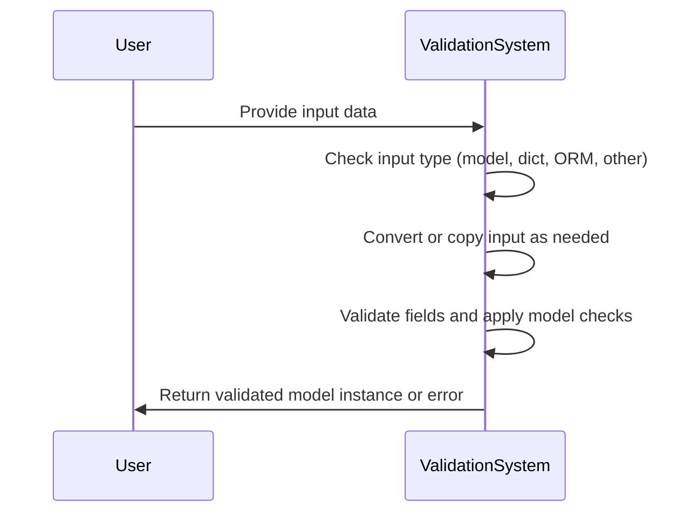

# Where is this flow used?

This flow is used multiple times in the codebase as represented in the following diagram:

```mermaid
graph TD;
      92c501da65493e23eeb527f4625f746c8a7dd027222ad2c7e85d3c4023a69666(pydantic/v1/main.py::__setattr__) --> 8ebdee4b4f4e57eedaae782903d664b40856efa5f55d43168ea326036946f848(pydantic/v1/main.py::validate):::mainFlowStyle

a35bdc93523cf79e802806d3975b77e7825442a9a1c764c944ed1b10e50d3b7b(pydantic/v1/main.py::validate_model):::mainFlowStyle --> 8ebdee4b4f4e57eedaae782903d664b40856efa5f55d43168ea326036946f848(pydantic/v1/main.py::validate):::mainFlowStyle

487a6f9955fb4fdc43cb7574ed9addc218a5d53d118c09679473b7a0637d07d6(pydantic/v1/main.py::__init__) --> a35bdc93523cf79e802806d3975b77e7825442a9a1c764c944ed1b10e50d3b7b(pydantic/v1/main.py::validate_model):::mainFlowStyle

d097b47f4c264edcd3b3d81082b8c9e9e9b9578cdc6a66c48073b7f34b99f494(pydantic/v1/main.py::from_orm):::mainFlowStyle --> a35bdc93523cf79e802806d3975b77e7825442a9a1c764c944ed1b10e50d3b7b(pydantic/v1/main.py::validate_model):::mainFlowStyle


classDef mainFlowStyle color:#000000,fill:#7CB9F4
classDef rootsStyle color:#000000,fill:#00FFF4
classDef Style1 color:#000000,fill:#00FFAA
classDef Style2 color:#000000,fill:#FFFF00
classDef Style3 color:#000000,fill:#AA7CB9

%% Swimm:
%% graph TD;
%%       92c501da65493e23eeb527f4625f746c8a7dd027222ad2c7e85d3c4023a69666(<SwmPath>[pydantic/v1/main.py](pydantic/v1/main.py)</SwmPath>::__setattr__) --> 8ebdee4b4f4e57eedaae782903d664b40856efa5f55d43168ea326036946f848(<SwmPath>[pydantic/v1/main.py](pydantic/v1/main.py)</SwmPath>::validate):::mainFlowStyle
%% 
%% a35bdc93523cf79e802806d3975b77e7825442a9a1c764c944ed1b10e50d3b7b(<SwmPath>[pydantic/v1/main.py](pydantic/v1/main.py)</SwmPath>::<SwmToken path="pydantic/v1/main.py" pos="583:11:11" line-data="        values, fields_set, validation_error = validate_model(cls, obj)">`validate_model`</SwmToken>):::mainFlowStyle --> 8ebdee4b4f4e57eedaae782903d664b40856efa5f55d43168ea326036946f848(<SwmPath>[pydantic/v1/main.py](pydantic/v1/main.py)</SwmPath>::validate):::mainFlowStyle
%% 
%% 487a6f9955fb4fdc43cb7574ed9addc218a5d53d118c09679473b7a0637d07d6(<SwmPath>[pydantic/v1/main.py](pydantic/v1/main.py)</SwmPath>::__init__) --> a35bdc93523cf79e802806d3975b77e7825442a9a1c764c944ed1b10e50d3b7b(<SwmPath>[pydantic/v1/main.py](pydantic/v1/main.py)</SwmPath>::<SwmToken path="pydantic/v1/main.py" pos="583:11:11" line-data="        values, fields_set, validation_error = validate_model(cls, obj)">`validate_model`</SwmToken>):::mainFlowStyle
%% 
%% d097b47f4c264edcd3b3d81082b8c9e9e9b9578cdc6a66c48073b7f34b99f494(<SwmPath>[pydantic/v1/main.py](pydantic/v1/main.py)</SwmPath>::<SwmToken path="pydantic/v1/main.py" pos="578:3:3" line-data="    def from_orm(cls: Type[&#39;Model&#39;], obj: Any) -&gt; &#39;Model&#39;:">`from_orm`</SwmToken>):::mainFlowStyle --> a35bdc93523cf79e802806d3975b77e7825442a9a1c764c944ed1b10e50d3b7b(<SwmPath>[pydantic/v1/main.py](pydantic/v1/main.py)</SwmPath>::<SwmToken path="pydantic/v1/main.py" pos="583:11:11" line-data="        values, fields_set, validation_error = validate_model(cls, obj)">`validate_model`</SwmToken>):::mainFlowStyle
%% 
%% 
%% classDef mainFlowStyle color:#000000,fill:#7CB9F4
%% classDef rootsStyle color:#000000,fill:#00FFF4
%% classDef Style1 color:#000000,fill:#00FFAA
%% classDef Style2 color:#000000,fill:#FFFF00
%% classDef Style3 color:#000000,fill:#AA7CB9
```

# Spec

## Detailed View of the Program's Functionality

# a. Deciding How to Handle Existing Model Instances

When validating input data to create or update a model, the code first checks if the input is already an instance of the model class. If it is, the model's configuration is consulted to determine whether to return the instance as-is, make a shallow copy, or make a deep copy. This is controlled by a configuration option that can be set to 'deep', 'shallow', or 'none'. If copying is needed, a helper function is called to create a new instance with the same data (deeply or shallowly copied as appropriate). If no copy is needed, the original instance is returned immediately.

# b. Building a New Model Instance with Copied Data

When a copy of a model instance is required, the code first decides whether to perform a deep or shallow copy of the model's data. It then creates a new, uninitialized instance of the model class. The internal state (the dictionary of field values and the set of fields that have been set) is assigned directly to this new instance. Private attributes are also copied over, using a deep copy if requested. This ensures the new instance is a faithful copy of the original, with all fields and private attributes set appropriately.

# c. Merging Model Inheritance and Configuration

When a new model class is created (either by subclassing or dynamically), the code merges information from all base classes. This includes fields, configuration, validators, private attributes, class variables, and hash functions. If there are conflicting configuration sources (<SwmToken path="pydantic/v1/main.py" pos="295:16:18" line-data="        # for attributes not in `new_namespace` (e.g. private attributes)">`e.g`</SwmToken>., both a Config class and config keyword arguments), an error is raised. The merged configuration and validators are then used to set up the new model class. Type annotations are processed to determine which attributes are fields, class variables, or private attributes, and field definitions are inferred as needed. The final model class is assembled with all this information, and any necessary post-processing (such as resolving forward references) is performed.

# d. Assigning State to the New Model Instance

After creating a new model instance (for copying), the code assigns the internal dictionary of field values and the set of fields that have been set. It then iterates over all private attributes defined on the model, copying their values from the original instance to the new one. If a deep copy was requested, the values are deep-copied; otherwise, they are assigned directly. This ensures that the new instance has the same state as the original, including any private data.

# e. Converting Arbitrary Input to a Model Instance

If the input to validation is not already a model instance, the code checks if it is a dictionary. If so, it creates a new model instance using the dictionary as keyword arguments. If the model is configured for ORM mode, it attempts to create the model from an ORM object. If neither of these applies, it tries to convert the input to a dictionary (using the dict constructor). If this fails, an error is raised. This allows the model to accept a variety of input types and convert them into a consistent internal representation.

# f. Building a Model from ORM Objects

When creating a model from an ORM object, the code first checks that ORM mode is enabled in the configuration. It then prepares the input data, either by wrapping it as a custom root type or by decomposing the object into a dictionary-like structure. A new, uninitialized model instance is created, and the input data is validated against the model's schema. The validated values and set of fields are assigned to the new instance, and private attributes are initialized. If validation fails, an error is raised.

# g. Running Model Validation and Collecting Errors

The core validation function begins by running any pre-root validators on the input data. It then iterates over each field in the model, attempting to extract and validate the value for that field from the input data. If a value is missing and required, an error is collected. If a value is present, it is validated, and any errors are collected. After all fields are processed, the function checks for any extra fields in the input data (fields not defined on the model). Depending on the configuration, these may be included, ignored, or flagged as errors. Finally, any post-root validators are run, and any errors are collected. The function returns the validated values, the set of fields that were set, and any validation errors.

# h. Finalizing the Model Instance from ORM Data

After validating ORM data, the code checks for validation errors. If any are present, an error is raised. Otherwise, the validated values and set of fields are assigned to the new model instance, and private attributes are initialized. The fully-initialized model instance is then returned.

# i. Handling Non-ORM, Non-Dict Input in Validation

If the input to validation is not a dictionary and ORM mode is not enabled, the code attempts to convert the input to a dictionary using the dict constructor. If this fails, an error is raised. If successful, the resulting dictionary is used to create a new model instance.

# j. Serializing the Model to a Dictionary

To serialize a model to a dictionary, the code provides a method that returns a dictionary representation of the model. This method accepts options to include or exclude specific fields, use field aliases, and control whether unset, default, or None values are included. The actual work is done by an internal iterator that yields key-value pairs for the fields to be included in the output.

# k. Iterating Over Model Fields for Serialization

The internal iterator method merges any include or exclude options provided by the user or defined on the model. It then determines which fields are allowed in the output, based on these options and whether only explicitly set fields should be included. For each field, it checks whether the field should be included (based on filters like <SwmToken path="pydantic/v1/main.py" pos="442:1:1" line-data="        exclude_none: bool = False,">`exclude_none`</SwmToken> and <SwmToken path="pydantic/v1/main.py" pos="441:1:1" line-data="        exclude_defaults: bool = False,">`exclude_defaults`</SwmToken>). If the field passes, its value is transformed as needed (<SwmToken path="pydantic/v1/main.py" pos="295:16:18" line-data="        # for attributes not in `new_namespace` (e.g. private attributes)">`e.g`</SwmToken>., converting nested models to dictionaries, applying aliases), and the key-value pair is yielded for inclusion in the output.

# l. Filtering Model Fields for Output

A helper function determines the set of keys (fields) to include in the output, based on include/exclude options and whether only explicitly set fields should be included. It starts with either the set of explicitly set fields or all fields, then applies include and exclude filters, and removes any fields that are being updated. The resulting set of keys is used to filter the output.

# m. Duplicating the Model with Field Selection

When duplicating a model (<SwmToken path="pydantic/v1/main.py" pos="295:16:18" line-data="        # for attributes not in `new_namespace` (e.g. private attributes)">`e.g`</SwmToken>., for copying or filtering fields), the code uses the internal iterator to collect the current field values, filtered by any include or exclude options. It then merges these values with any updates provided by the user. The set of fields that are considered set is updated accordingly. Finally, a new model instance is created with the selected values and fields, using the same copying mechanism as before.

# n. Finalizing the Set of Keys for Output

After preparing the set of keys to include in the output, the code applies any include or exclude filters, removes any fields being updated, and returns the final set of keys. This set is used to control which fields are included in the serialized output.

# o. Filtering and Preparing Field Values for Output

When serializing the model, the code iterates over the fields and applies all relevant filters (such as <SwmToken path="pydantic/v1/main.py" pos="442:1:1" line-data="        exclude_none: bool = False,">`exclude_none`</SwmToken> and <SwmToken path="pydantic/v1/main.py" pos="441:1:1" line-data="        exclude_defaults: bool = False,">`exclude_defaults`</SwmToken>). For each field that passes the filters, it determines the output key (using the alias if requested) and transforms the value as needed. If the value is a nested model, dictionary, or sequence, it is recursively processed to apply the same filters and transformations. The resulting key-value pairs are yielded for inclusion in the output.

# p. Recursively Filtering and Serializing Field Values

A helper function handles the recursive transformation of field values during serialization. If the value is a model instance and dictionary output is requested, it calls the model's dict method with all relevant options. If the value is a dictionary or sequence, it recursively processes each item or element, applying include/exclude filters as needed. If the value is an Enum and the configuration specifies using Enum values, it returns the Enum's value. Otherwise, it returns the value as-is.

# q. Yielding the Final Filtered Key/Value Pairs

After processing and filtering each field, the iterator yields the final key-value pairs for the caller to use. This allows the model to be serialized to a dictionary or JSON with precise control over which fields are included and how they are represented.

# Rule Definition

| Paragraph Name                                                                                                                                                                                                                                                                                                                                                                                                                                                                                                                                                                                                                                                                                                                                                                                                                                                                                                           | Rule ID | Category          | Description                                                                                                                                                                                                                                                                                                                                                                                                                 | Conditions                                                                                                                                                                                                                                                                                                                | Remarks                                                                                                                                                                                                                                                                                                                                                                                                                                                                                                                                                                                                                         |
| ------------------------------------------------------------------------------------------------------------------------------------------------------------------------------------------------------------------------------------------------------------------------------------------------------------------------------------------------------------------------------------------------------------------------------------------------------------------------------------------------------------------------------------------------------------------------------------------------------------------------------------------------------------------------------------------------------------------------------------------------------------------------------------------------------------------------------------------------------------------------------------------------------------------------ | ------- | ----------------- | --------------------------------------------------------------------------------------------------------------------------------------------------------------------------------------------------------------------------------------------------------------------------------------------------------------------------------------------------------------------------------------------------------------------------- | ------------------------------------------------------------------------------------------------------------------------------------------------------------------------------------------------------------------------------------------------------------------------------------------------------------------------- | ------------------------------------------------------------------------------------------------------------------------------------------------------------------------------------------------------------------------------------------------------------------------------------------------------------------------------------------------------------------------------------------------------------------------------------------------------------------------------------------------------------------------------------------------------------------------------------------------------------------------------- |
| <SwmToken path="pydantic/v1/main.py" pos="137:12:12" line-data="            if _is_base_model_class_defined and issubclass(base, BaseModel) and base != BaseModel:">`BaseModel`</SwmToken>.**init**, <SwmToken path="pydantic/v1/main.py" pos="583:11:11" line-data="        values, fields_set, validation_error = validate_model(cls, obj)">`validate_model`</SwmToken>                                                                                                                                                                                                                                                                                                                                                                                                                                                                                                                                                | RL-001  | Conditional Logic | When a model is instantiated, keyword arguments matching field names or aliases are validated and set as model fields. Validation errors are raised if input data is invalid.                                                                                                                                                                                                                                               | Model is instantiated with keyword arguments.                                                                                                                                                                                                                                                                             | Field names and aliases are matched; validation errors are raised as <SwmToken path="pydantic/v1/main.py" pos="1038:18:18" line-data=") -&gt; Tuple[&#39;DictStrAny&#39;, &#39;SetStr&#39;, Optional[ValidationError]]:">`ValidationError`</SwmToken>. Field values are stored in the instance's **dict**, and the set of fields set is tracked in <SwmToken path="pydantic/v1/main.py" pos="583:4:4" line-data="        values, fields_set, validation_error = validate_model(cls, obj)">`fields_set`</SwmToken>.                                                                                                              |
| BaseModel.validate                                                                                                                                                                                                                                                                                                                                                                                                                                                                                                                                                                                                                                                                                                                                                                                                                                                                                                       | RL-002  | Conditional Logic | The validate classmethod accepts any input (model instance, dict, ORM object, or convertible object) and returns a validated model instance, copying if configured.                                                                                                                                                                                                                                                         | validate is called with any input.                                                                                                                                                                                                                                                                                        | If input is already a model instance, may return a copy depending on config. If input is dict, validates and constructs. If ORM mode is enabled and input is not dict, uses <SwmToken path="pydantic/v1/main.py" pos="578:3:3" line-data="    def from_orm(cls: Type[&#39;Model&#39;], obj: Any) -&gt; &#39;Model&#39;:">`from_orm`</SwmToken>. Otherwise, attempts to convert to dict.                                                                                                                                                                                                                                         |
| <SwmToken path="pydantic/v1/main.py" pos="383:26:28" line-data="                # - keep other values (e.g. submodels) untouched (using `BaseModel.dict()` will change them into dicts)">`BaseModel.dict`</SwmToken>, BaseModel.\_iter, BaseModel.\_get_value                                                                                                                                                                                                                                                                                                                                                                                                                                                                                                                                                                                                                                                            | RL-003  | Computation       | The dict method serializes the model to a dictionary, supporting field filtering (include/exclude), aliasing, and options to exclude unset, default, or None fields. Recursively applies to nested models.                                                                                                                                                                                                                  | dict() is called on a model instance.                                                                                                                                                                                                                                                                                     | Supports include/exclude as sets or mappings, <SwmToken path="pydantic/v1/main.py" pos="438:1:1" line-data="        by_alias: bool = False,">`by_alias`</SwmToken>, <SwmToken path="pydantic/v1/main.py" pos="440:1:1" line-data="        exclude_unset: bool = False,">`exclude_unset`</SwmToken>, <SwmToken path="pydantic/v1/main.py" pos="441:1:1" line-data="        exclude_defaults: bool = False,">`exclude_defaults`</SwmToken>, <SwmToken path="pydantic/v1/main.py" pos="442:1:1" line-data="        exclude_none: bool = False,">`exclude_none`</SwmToken>. For custom root types, returns the root value directly. |
| BaseModel.copy, BaseModel.\_copy_and_set_values                                                                                                                                                                                                                                                                                                                                                                                                                                                                                                                                                                                                                                                                                                                                                                                                                                                                          | RL-004  | Computation       | The copy method returns a new model instance with the same field values, supporting include/exclude filtering, updating fields, and deep or shallow copying.                                                                                                                                                                                                                                                                | copy() is called on a model instance.                                                                                                                                                                                                                                                                                     | Supports include/exclude, update, deep options. Private attributes are also copied.                                                                                                                                                                                                                                                                                                                                                                                                                                                                                                                                             |
| BaseModel.from_orm                                                                                                                                                                                                                                                                                                                                                                                                                                                                                                                                                                                                                                                                                                                                                                                                                                                                                                       | RL-005  | Conditional Logic | <SwmToken path="pydantic/v1/main.py" pos="578:3:3" line-data="    def from_orm(cls: Type[&#39;Model&#39;], obj: Any) -&gt; &#39;Model&#39;:">`from_orm`</SwmToken> builds a model instance from an ORM object if <SwmToken path="pydantic/v1/main.py" pos="579:9:9" line-data="        if not cls.__config__.orm_mode:">`orm_mode`</SwmToken> is enabled, extracting field values via attribute access and validating them. | <SwmToken path="pydantic/v1/main.py" pos="578:3:3" line-data="    def from_orm(cls: Type[&#39;Model&#39;], obj: Any) -&gt; &#39;Model&#39;:">`from_orm`</SwmToken> is called and <SwmToken path="pydantic/v1/main.py" pos="579:9:9" line-data="        if not cls.__config__.orm_mode:">`orm_mode`</SwmToken> is enabled. | Raises <SwmToken path="pydantic/v1/main.py" pos="580:3:3" line-data="            raise ConfigError(&#39;You must have the config attribute orm_mode=True to use from_orm&#39;)">`ConfigError`</SwmToken> if <SwmToken path="pydantic/v1/main.py" pos="579:9:9" line-data="        if not cls.__config__.orm_mode:">`orm_mode`</SwmToken> is not enabled. Uses attribute access to extract values. Initializes private attributes after validation.                                                                                                                                                                              |
| BaseModel.parse_obj                                                                                                                                                                                                                                                                                                                                                                                                                                                                                                                                                                                                                                                                                                                                                                                                                                                                                                      | RL-006  | Conditional Logic | <SwmToken path="pydantic/v1/main.py" pos="524:3:3" line-data="    def parse_obj(cls: Type[&#39;Model&#39;], obj: Any) -&gt; &#39;Model&#39;:">`parse_obj`</SwmToken> builds a model instance from a dict-like object, validating input and raising a validation error if invalid.                                                                                                                                           | <SwmToken path="pydantic/v1/main.py" pos="524:3:3" line-data="    def parse_obj(cls: Type[&#39;Model&#39;], obj: Any) -&gt; &#39;Model&#39;:">`parse_obj`</SwmToken> is called with a dict-like object.                                                                                                                   | If input is not dict, attempts to convert. Raises <SwmToken path="pydantic/v1/main.py" pos="1038:18:18" line-data=") -&gt; Tuple[&#39;DictStrAny&#39;, &#39;SetStr&#39;, Optional[ValidationError]]:">`ValidationError`</SwmToken> if conversion fails.                                                                                                                                                                                                                                                                                                                                                                         |
| BaseModel.construct                                                                                                                                                                                                                                                                                                                                                                                                                                                                                                                                                                                                                                                                                                                                                                                                                                                                                                      | RL-007  | Data Assignment   | construct creates a model instance from trusted data, setting field values directly without validation.                                                                                                                                                                                                                                                                                                                     | construct is called with keyword arguments.                                                                                                                                                                                                                                                                               | No validation is performed. Default values are respected. All passed values are added.                                                                                                                                                                                                                                                                                                                                                                                                                                                                                                                                          |
| <SwmToken path="pydantic/v1/main.py" pos="113:5:5" line-data="# Note `ModelMetaclass` refers to `BaseModel`, but is also used to *create* `BaseModel`, so we need to add this extra">`ModelMetaclass`</SwmToken>.**new**, BaseModel.\_init_private_attributes, <SwmToken path="pydantic/v1/main.py" pos="137:12:12" line-data="            if _is_base_model_class_defined and issubclass(base, BaseModel) and base != BaseModel:">`BaseModel`</SwmToken>.**setattr**, <SwmToken path="pydantic/v1/main.py" pos="137:12:12" line-data="            if _is_base_model_class_defined and issubclass(base, BaseModel) and base != BaseModel:">`BaseModel`</SwmToken>.**getstate**, <SwmToken path="pydantic/v1/main.py" pos="137:12:12" line-data="            if _is_base_model_class_defined and issubclass(base, BaseModel) and base != BaseModel:">`BaseModel`</SwmToken>.**setstate**, BaseModel.\_copy_and_set_values | RL-008  | Conditional Logic | Private attributes (names starting with underscore) are not included in serialization or validation, are defined via helper or naming convention, and are stored/accessed per-instance.                                                                                                                                                                                                                                     | Private attributes are defined or accessed.                                                                                                                                                                                                                                                                               | Private attribute metadata is stored in <SwmToken path="pydantic/v1/main.py" pos="129:1:1" line-data="        private_attributes: Dict[str, ModelPrivateAttr] = {}">`private_attributes`</SwmToken>. Values are set per-instance and not included in dict/json.                                                                                                                                                                                                                                                                                                                                                                 |
| <SwmToken path="pydantic/v1/main.py" pos="113:5:5" line-data="# Note `ModelMetaclass` refers to `BaseModel`, but is also used to *create* `BaseModel`, so we need to add this extra">`ModelMetaclass`</SwmToken>.**new**, <SwmToken path="pydantic/v1/main.py" pos="240:1:1" line-data="            validate_custom_root_type(fields)">`validate_custom_root_type`</SwmToken>, <SwmToken path="pydantic/v1/main.py" pos="383:26:28" line-data="                # - keep other values (e.g. submodels) untouched (using `BaseModel.dict()` will change them into dicts)">`BaseModel.dict`</SwmToken>, BaseModel.json, BaseModel.\_enforce_dict_if_root, BaseModel.parse_obj, BaseModel.from_orm                                                                                                                                                                                                                           | RL-009  | Conditional Logic | If a model has a single field named **root**, it is treated as a custom root type, and serialization/validation treats the model as wrapping a single value.                                                                                                                                                                                                                                                                | Model has a single field named **root**.                                                                                                                                                                                                                                                                                  | On serialization, output is the value of **root**, not a dict. On parsing, input is wrapped/unwrapped as needed.                                                                                                                                                                                                                                                                                                                                                                                                                                                                                                                |
| <SwmToken path="pydantic/v1/main.py" pos="583:11:11" line-data="        values, fields_set, validation_error = validate_model(cls, obj)">`validate_model`</SwmToken>, <SwmToken path="pydantic/v1/main.py" pos="137:12:12" line-data="            if _is_base_model_class_defined and issubclass(base, BaseModel) and base != BaseModel:">`BaseModel`</SwmToken>.**setattr**                                                                                                                                                                                                                                                                                                                                                                                                                                                                                                                                             | RL-010  | Conditional Logic | Extra fields in input are handled according to the model's configuration: allowed, ignored, or flagged as errors.                                                                                                                                                                                                                                                                                                           | Input data contains fields not defined in the model.                                                                                                                                                                                                                                                                      | <SwmToken path="pydantic/v1/main.py" pos="596:8:10" line-data="        Behaves as if `Config.extra = &#39;allow&#39;` was set since it adds all passed values">`Config.extra`</SwmToken> can be <SwmToken path="pydantic/v1/main.py" pos="1095:9:11" line-data="            if config.extra is Extra.allow:">`Extra.allow`</SwmToken>, <SwmToken path="pydantic/v1/main.py" pos="1049:13:15" line-data="    check_extra = config.extra is not Extra.ignore">`Extra.ignore`</SwmToken>, or Extra.forbid. Extra fields are added, ignored, or cause errors accordingly.                                                           |
| <SwmToken path="pydantic/v1/main.py" pos="137:12:12" line-data="            if _is_base_model_class_defined and issubclass(base, BaseModel) and base != BaseModel:">`BaseModel`</SwmToken>.**eq**                                                                                                                                                                                                                                                                                                                                                                                                                                                                                                                                                                                                                                                                                                                        | RL-011  | Computation       | Model instances are compared for equality based on their field values.                                                                                                                                                                                                                                                                                                                                                      | Equality operator is used between model instances.                                                                                                                                                                                                                                                                        | Compares dict representations of models.                                                                                                                                                                                                                                                                                                                                                                                                                                                                                                                                                                                        |
| <SwmToken path="pydantic/v1/main.py" pos="137:12:12" line-data="            if _is_base_model_class_defined and issubclass(base, BaseModel) and base != BaseModel:">`BaseModel`</SwmToken>.**iter**                                                                                                                                                                                                                                                                                                                                                                                                                                                                                                                                                                                                                                                                                                                      | RL-012  | Computation       | Model instances support iteration over their fields, yielding key/value pairs.                                                                                                                                                                                                                                                                                                                                              | Model instance is iterated.                                                                                                                                                                                                                                                                                               | Yields items from **dict**.                                                                                                                                                                                                                                                                                                                                                                                                                                                                                                                                                                                                     |
| BaseModel.schema, BaseModel.schema_json                                                                                                                                                                                                                                                                                                                                                                                                                                                                                                                                                                                                                                                                                                                                                                                                                                                                                  | RL-013  | Computation       | Models can generate JSON schema representations via schema and <SwmToken path="pydantic/v1/main.py" pos="675:3:3" line-data="    def schema_json(">`schema_json`</SwmToken> classmethods.                                                                                                                                                                                                                                   | schema or <SwmToken path="pydantic/v1/main.py" pos="675:3:3" line-data="    def schema_json(">`schema_json`</SwmToken> is called.                                                                                                                                                                                         | schema returns a dict; <SwmToken path="pydantic/v1/main.py" pos="675:3:3" line-data="    def schema_json(">`schema_json`</SwmToken> returns a JSON string. Uses <SwmToken path="pydantic/v1/main.py" pos="44:13:13" line-data="from pydantic.v1.schema import default_ref_template, model_schema">`model_schema`</SwmToken> and config's <SwmToken path="pydantic/v1/main.py" pos="510:7:7" line-data="        return self.__config__.json_dumps(data, default=encoder, **dumps_kwargs)">`json_dumps`</SwmToken>.                                                                                                               |
| BaseModel.json                                                                                                                                                                                                                                                                                                                                                                                                                                                                                                                                                                                                                                                                                                                                                                                                                                                                                                           | RL-014  | Computation       | Models can be serialized to JSON strings, supporting the same filtering and formatting options as dict().                                                                                                                                                                                                                                                                                                                   | json() is called on a model instance.                                                                                                                                                                                                                                                                                     | Supports include/exclude, <SwmToken path="pydantic/v1/main.py" pos="438:1:1" line-data="        by_alias: bool = False,">`by_alias`</SwmToken>, <SwmToken path="pydantic/v1/main.py" pos="440:1:1" line-data="        exclude_unset: bool = False,">`exclude_unset`</SwmToken>, <SwmToken path="pydantic/v1/main.py" pos="441:1:1" line-data="        exclude_defaults: bool = False,">`exclude_defaults`</SwmToken>, <SwmToken path="pydantic/v1/main.py" pos="442:1:1" line-data="        exclude_none: bool = False,">`exclude_none`</SwmToken>, and custom encoder.                                                         |

# User Stories

## User Story 1: Model instantiation, validation, and parsing from various sources

---

### Story Description:

As a user of data models, I want to instantiate and validate models from different input types (dicts, ORM objects, other models, or convertible objects) so that I can ensure my data is correct, receive clear validation errors, and flexibly construct models from trusted or untrusted sources.

---

### Business Rule Mapping:

| Rule ID | Paragraph Name                                                                                                                                                                                                                                                                                                                                                                                                                                                                                                                                                                                                                                                                                 | Rule Description                                                                                                                                                                                                                                                                                                                                                                                                            |
| ------- | ---------------------------------------------------------------------------------------------------------------------------------------------------------------------------------------------------------------------------------------------------------------------------------------------------------------------------------------------------------------------------------------------------------------------------------------------------------------------------------------------------------------------------------------------------------------------------------------------------------------------------------------------------------------------------------------------- | --------------------------------------------------------------------------------------------------------------------------------------------------------------------------------------------------------------------------------------------------------------------------------------------------------------------------------------------------------------------------------------------------------------------------- |
| RL-010  | <SwmToken path="pydantic/v1/main.py" pos="583:11:11" line-data="        values, fields_set, validation_error = validate_model(cls, obj)">`validate_model`</SwmToken>, <SwmToken path="pydantic/v1/main.py" pos="137:12:12" line-data="            if _is_base_model_class_defined and issubclass(base, BaseModel) and base != BaseModel:">`BaseModel`</SwmToken>.**setattr**                                                                                                                                                                                                                                                                                                                   | Extra fields in input are handled according to the model's configuration: allowed, ignored, or flagged as errors.                                                                                                                                                                                                                                                                                                           |
| RL-001  | <SwmToken path="pydantic/v1/main.py" pos="137:12:12" line-data="            if _is_base_model_class_defined and issubclass(base, BaseModel) and base != BaseModel:">`BaseModel`</SwmToken>.**init**, <SwmToken path="pydantic/v1/main.py" pos="583:11:11" line-data="        values, fields_set, validation_error = validate_model(cls, obj)">`validate_model`</SwmToken>                                                                                                                                                                                                                                                                                                                      | When a model is instantiated, keyword arguments matching field names or aliases are validated and set as model fields. Validation errors are raised if input data is invalid.                                                                                                                                                                                                                                               |
| RL-002  | BaseModel.validate                                                                                                                                                                                                                                                                                                                                                                                                                                                                                                                                                                                                                                                                             | The validate classmethod accepts any input (model instance, dict, ORM object, or convertible object) and returns a validated model instance, copying if configured.                                                                                                                                                                                                                                                         |
| RL-005  | BaseModel.from_orm                                                                                                                                                                                                                                                                                                                                                                                                                                                                                                                                                                                                                                                                             | <SwmToken path="pydantic/v1/main.py" pos="578:3:3" line-data="    def from_orm(cls: Type[&#39;Model&#39;], obj: Any) -&gt; &#39;Model&#39;:">`from_orm`</SwmToken> builds a model instance from an ORM object if <SwmToken path="pydantic/v1/main.py" pos="579:9:9" line-data="        if not cls.__config__.orm_mode:">`orm_mode`</SwmToken> is enabled, extracting field values via attribute access and validating them. |
| RL-006  | BaseModel.parse_obj                                                                                                                                                                                                                                                                                                                                                                                                                                                                                                                                                                                                                                                                            | <SwmToken path="pydantic/v1/main.py" pos="524:3:3" line-data="    def parse_obj(cls: Type[&#39;Model&#39;], obj: Any) -&gt; &#39;Model&#39;:">`parse_obj`</SwmToken> builds a model instance from a dict-like object, validating input and raising a validation error if invalid.                                                                                                                                           |
| RL-007  | BaseModel.construct                                                                                                                                                                                                                                                                                                                                                                                                                                                                                                                                                                                                                                                                            | construct creates a model instance from trusted data, setting field values directly without validation.                                                                                                                                                                                                                                                                                                                     |
| RL-009  | <SwmToken path="pydantic/v1/main.py" pos="113:5:5" line-data="# Note `ModelMetaclass` refers to `BaseModel`, but is also used to *create* `BaseModel`, so we need to add this extra">`ModelMetaclass`</SwmToken>.**new**, <SwmToken path="pydantic/v1/main.py" pos="240:1:1" line-data="            validate_custom_root_type(fields)">`validate_custom_root_type`</SwmToken>, <SwmToken path="pydantic/v1/main.py" pos="383:26:28" line-data="                # - keep other values (e.g. submodels) untouched (using `BaseModel.dict()` will change them into dicts)">`BaseModel.dict`</SwmToken>, BaseModel.json, BaseModel.\_enforce_dict_if_root, BaseModel.parse_obj, BaseModel.from_orm | If a model has a single field named **root**, it is treated as a custom root type, and serialization/validation treats the model as wrapping a single value.                                                                                                                                                                                                                                                                |

---

### Relevant Functionality:

- <SwmToken path="pydantic/v1/main.py" pos="583:11:11" line-data="        values, fields_set, validation_error = validate_model(cls, obj)">`validate_model`</SwmToken>
  1. **RL-010:**
     - During validation, check for extra fields in input.
     - If <SwmToken path="pydantic/v1/main.py" pos="1095:9:11" line-data="            if config.extra is Extra.allow:">`Extra.allow`</SwmToken>, add extra fields to values.
     - If <SwmToken path="pydantic/v1/main.py" pos="1049:13:15" line-data="    check_extra = config.extra is not Extra.ignore">`Extra.ignore`</SwmToken>, skip extra fields.
     - If Extra.forbid, add errors for extra fields.
- **BaseModel.init**
  1. **RL-001:**
     - On model instantiation:
       - Call <SwmToken path="pydantic/v1/main.py" pos="583:11:11" line-data="        values, fields_set, validation_error = validate_model(cls, obj)">`validate_model`</SwmToken> with the class and input data.
       - If validation errors exist, raise <SwmToken path="pydantic/v1/main.py" pos="1038:18:18" line-data=") -&gt; Tuple[&#39;DictStrAny&#39;, &#39;SetStr&#39;, Optional[ValidationError]]:">`ValidationError`</SwmToken>.
       - Set validated values to the instance's **dict**.
       - Set <SwmToken path="pydantic/v1/main.py" pos="583:4:4" line-data="        values, fields_set, validation_error = validate_model(cls, obj)">`fields_set`</SwmToken> to the set of fields that were set.
       - Initialize private attributes.
- **BaseModel.validate**
  1. **RL-002:**
     - If input is instance of the model:
       - If <SwmToken path="pydantic/v1/main.py" pos="691:1:1" line-data="            copy_on_model_validation = cls.__config__.copy_on_model_validation">`copy_on_model_validation`</SwmToken> is set, return a (deep/shallow) copy.
       - Otherwise, return the instance.
     - If input is dict, call **init** with the dict.
     - If ORM mode is enabled, call <SwmToken path="pydantic/v1/main.py" pos="578:3:3" line-data="    def from_orm(cls: Type[&#39;Model&#39;], obj: Any) -&gt; &#39;Model&#39;:">`from_orm`</SwmToken>.
     - Otherwise, try to convert input to dict and call **init**.
     - Raise <SwmToken path="pydantic/v1/main.py" pos="724:3:3" line-data="                raise DictError() from e">`DictError`</SwmToken> if conversion fails.
- **BaseModel.from_orm**
  1. **RL-005:**
     - Check if <SwmToken path="pydantic/v1/main.py" pos="579:9:9" line-data="        if not cls.__config__.orm_mode:">`orm_mode`</SwmToken> is enabled; raise error if not.
     - Extract values from ORM object using attribute access.
     - Validate and construct model instance.
     - Initialize private attributes.
- **BaseModel.parse_obj**
  1. **RL-006:**
     - If custom root type, enforce dict with <SwmToken path="pydantic/v1/main.py" pos="238:5:5" line-data="        _custom_root_type = ROOT_KEY in fields">`ROOT_KEY`</SwmToken>.
     - If not dict, try to convert to dict.
     - If conversion fails, raise <SwmToken path="pydantic/v1/main.py" pos="1038:18:18" line-data=") -&gt; Tuple[&#39;DictStrAny&#39;, &#39;SetStr&#39;, Optional[ValidationError]]:">`ValidationError`</SwmToken>.
     - Call **init** with the dict.
- **BaseModel.construct**
  1. **RL-007:**
     - Create new instance without calling **init**.
     - Set **dict** to provided values and defaults.
     - Set <SwmToken path="pydantic/v1/main.py" pos="583:4:4" line-data="        values, fields_set, validation_error = validate_model(cls, obj)">`fields_set`</SwmToken> to provided or inferred set.
     - Initialize private attributes.
- **ModelMetaclass.new**
  1. **RL-009:**
     - On class creation, check for **root** field and validate exclusivity.
     - On dict/json serialization, return root value directly.
     - On parse_obj/from_orm, wrap/unwrap input as needed.

## User Story 2: Model serialization and copying with flexible filtering

---

### Story Description:

As a user of data models, I want to serialize models to dictionaries or JSON, filter which fields are included, and create deep or shallow copies, so that I can easily export, transform, or duplicate my data while respecting model configuration, custom root types, and private attributes.

---

### Business Rule Mapping:

| Rule ID | Paragraph Name                                                                                                                                                                                                                                                                                                                                                                                                                                                                                                                                                                                                                                                                                                                                                                                                                                                                                                           | Rule Description                                                                                                                                                                                           |
| ------- | ------------------------------------------------------------------------------------------------------------------------------------------------------------------------------------------------------------------------------------------------------------------------------------------------------------------------------------------------------------------------------------------------------------------------------------------------------------------------------------------------------------------------------------------------------------------------------------------------------------------------------------------------------------------------------------------------------------------------------------------------------------------------------------------------------------------------------------------------------------------------------------------------------------------------ | ---------------------------------------------------------------------------------------------------------------------------------------------------------------------------------------------------------- |
| RL-003  | <SwmToken path="pydantic/v1/main.py" pos="383:26:28" line-data="                # - keep other values (e.g. submodels) untouched (using `BaseModel.dict()` will change them into dicts)">`BaseModel.dict`</SwmToken>, BaseModel.\_iter, BaseModel.\_get_value                                                                                                                                                                                                                                                                                                                                                                                                                                                                                                                                                                                                                                                            | The dict method serializes the model to a dictionary, supporting field filtering (include/exclude), aliasing, and options to exclude unset, default, or None fields. Recursively applies to nested models. |
| RL-004  | BaseModel.copy, BaseModel.\_copy_and_set_values                                                                                                                                                                                                                                                                                                                                                                                                                                                                                                                                                                                                                                                                                                                                                                                                                                                                          | The copy method returns a new model instance with the same field values, supporting include/exclude filtering, updating fields, and deep or shallow copying.                                               |
| RL-009  | <SwmToken path="pydantic/v1/main.py" pos="113:5:5" line-data="# Note `ModelMetaclass` refers to `BaseModel`, but is also used to *create* `BaseModel`, so we need to add this extra">`ModelMetaclass`</SwmToken>.**new**, <SwmToken path="pydantic/v1/main.py" pos="240:1:1" line-data="            validate_custom_root_type(fields)">`validate_custom_root_type`</SwmToken>, <SwmToken path="pydantic/v1/main.py" pos="383:26:28" line-data="                # - keep other values (e.g. submodels) untouched (using `BaseModel.dict()` will change them into dicts)">`BaseModel.dict`</SwmToken>, BaseModel.json, BaseModel.\_enforce_dict_if_root, BaseModel.parse_obj, BaseModel.from_orm                                                                                                                                                                                                                           | If a model has a single field named **root**, it is treated as a custom root type, and serialization/validation treats the model as wrapping a single value.                                               |
| RL-008  | <SwmToken path="pydantic/v1/main.py" pos="113:5:5" line-data="# Note `ModelMetaclass` refers to `BaseModel`, but is also used to *create* `BaseModel`, so we need to add this extra">`ModelMetaclass`</SwmToken>.**new**, BaseModel.\_init_private_attributes, <SwmToken path="pydantic/v1/main.py" pos="137:12:12" line-data="            if _is_base_model_class_defined and issubclass(base, BaseModel) and base != BaseModel:">`BaseModel`</SwmToken>.**setattr**, <SwmToken path="pydantic/v1/main.py" pos="137:12:12" line-data="            if _is_base_model_class_defined and issubclass(base, BaseModel) and base != BaseModel:">`BaseModel`</SwmToken>.**getstate**, <SwmToken path="pydantic/v1/main.py" pos="137:12:12" line-data="            if _is_base_model_class_defined and issubclass(base, BaseModel) and base != BaseModel:">`BaseModel`</SwmToken>.**setstate**, BaseModel.\_copy_and_set_values | Private attributes (names starting with underscore) are not included in serialization or validation, are defined via helper or naming convention, and are stored/accessed per-instance.                    |
| RL-014  | BaseModel.json                                                                                                                                                                                                                                                                                                                                                                                                                                                                                                                                                                                                                                                                                                                                                                                                                                                                                                           | Models can be serialized to JSON strings, supporting the same filtering and formatting options as dict().                                                                                                  |

---

### Relevant Functionality:

- <SwmToken path="pydantic/v1/main.py" pos="383:26:28" line-data="                # - keep other values (e.g. submodels) untouched (using `BaseModel.dict()` will change them into dicts)">`BaseModel.dict`</SwmToken>
  1. **RL-003:**
     - Merge include/exclude options with field-level includes/excludes.
     - Calculate allowed keys based on include/exclude/unset.
     - For each allowed field:
       - If <SwmToken path="pydantic/v1/main.py" pos="441:1:1" line-data="        exclude_defaults: bool = False,">`exclude_defaults`</SwmToken> and value is default, skip.
       - If <SwmToken path="pydantic/v1/main.py" pos="438:1:1" line-data="        by_alias: bool = False,">`by_alias`</SwmToken>, use alias as key.
       - Recursively call dict on nested models or process dicts/sequences.
       - For custom root types, return root value.
- **BaseModel.copy**
  1. **RL-004:**
     - Gather values using \_iter with include/exclude.
     - Merge in update values if provided.
     - Determine new <SwmToken path="pydantic/v1/main.py" pos="583:4:4" line-data="        values, fields_set, validation_error = validate_model(cls, obj)">`fields_set`</SwmToken>.
     - Call <SwmToken path="pydantic/v1/main.py" pos="615:3:3" line-data="    def _copy_and_set_values(self: &#39;Model&#39;, values: &#39;DictStrAny&#39;, fields_set: &#39;SetStr&#39;, *, deep: bool) -&gt; &#39;Model&#39;:">`_copy_and_set_values`</SwmToken> with values, <SwmToken path="pydantic/v1/main.py" pos="583:4:4" line-data="        values, fields_set, validation_error = validate_model(cls, obj)">`fields_set`</SwmToken>, and deep option.
     - Copy private attributes as well.
- **ModelMetaclass.new**
  1. **RL-009:**
     - On class creation, check for **root** field and validate exclusivity.
     - On dict/json serialization, return root value directly.
     - On parse_obj/from_orm, wrap/unwrap input as needed.
  2. **RL-008:**
     - During class creation, collect private attributes by naming convention or helper.
     - On instance init, set private attributes to their defaults.
     - Exclude private attributes from serialization and validation.
     - Copy private attributes when copying model.
- **BaseModel.json**
  1. **RL-014:**
     - Gather data using \_iter with filtering options.
     - If custom root type, use root value.
     - Serialize data to JSON using config's <SwmToken path="pydantic/v1/main.py" pos="510:7:7" line-data="        return self.__config__.json_dumps(data, default=encoder, **dumps_kwargs)">`json_dumps`</SwmToken> and encoder.

## User Story 3: Model configuration and attribute access

---

### Story Description:

As a user of data models, I want to define model fields and private attributes with type annotations and configuration options, so that I can control how my models behave, how extra fields are handled, and how sensitive or internal data is managed.

---

### Business Rule Mapping:

| Rule ID | Paragraph Name                                                                                                                                                                                                                                                                                                                                                                                                                                                                                                                                                                                                                                                                                                                                                                                                                                                                                                           | Rule Description                                                                                                                                                                        |
| ------- | ------------------------------------------------------------------------------------------------------------------------------------------------------------------------------------------------------------------------------------------------------------------------------------------------------------------------------------------------------------------------------------------------------------------------------------------------------------------------------------------------------------------------------------------------------------------------------------------------------------------------------------------------------------------------------------------------------------------------------------------------------------------------------------------------------------------------------------------------------------------------------------------------------------------------ | --------------------------------------------------------------------------------------------------------------------------------------------------------------------------------------- |
| RL-010  | <SwmToken path="pydantic/v1/main.py" pos="583:11:11" line-data="        values, fields_set, validation_error = validate_model(cls, obj)">`validate_model`</SwmToken>, <SwmToken path="pydantic/v1/main.py" pos="137:12:12" line-data="            if _is_base_model_class_defined and issubclass(base, BaseModel) and base != BaseModel:">`BaseModel`</SwmToken>.**setattr**                                                                                                                                                                                                                                                                                                                                                                                                                                                                                                                                             | Extra fields in input are handled according to the model's configuration: allowed, ignored, or flagged as errors.                                                                       |
| RL-008  | <SwmToken path="pydantic/v1/main.py" pos="113:5:5" line-data="# Note `ModelMetaclass` refers to `BaseModel`, but is also used to *create* `BaseModel`, so we need to add this extra">`ModelMetaclass`</SwmToken>.**new**, BaseModel.\_init_private_attributes, <SwmToken path="pydantic/v1/main.py" pos="137:12:12" line-data="            if _is_base_model_class_defined and issubclass(base, BaseModel) and base != BaseModel:">`BaseModel`</SwmToken>.**setattr**, <SwmToken path="pydantic/v1/main.py" pos="137:12:12" line-data="            if _is_base_model_class_defined and issubclass(base, BaseModel) and base != BaseModel:">`BaseModel`</SwmToken>.**getstate**, <SwmToken path="pydantic/v1/main.py" pos="137:12:12" line-data="            if _is_base_model_class_defined and issubclass(base, BaseModel) and base != BaseModel:">`BaseModel`</SwmToken>.**setstate**, BaseModel.\_copy_and_set_values | Private attributes (names starting with underscore) are not included in serialization or validation, are defined via helper or naming convention, and are stored/accessed per-instance. |

---

### Relevant Functionality:

- <SwmToken path="pydantic/v1/main.py" pos="583:11:11" line-data="        values, fields_set, validation_error = validate_model(cls, obj)">`validate_model`</SwmToken>
  1. **RL-010:**
     - During validation, check for extra fields in input.
     - If <SwmToken path="pydantic/v1/main.py" pos="1095:9:11" line-data="            if config.extra is Extra.allow:">`Extra.allow`</SwmToken>, add extra fields to values.
     - If <SwmToken path="pydantic/v1/main.py" pos="1049:13:15" line-data="    check_extra = config.extra is not Extra.ignore">`Extra.ignore`</SwmToken>, skip extra fields.
     - If Extra.forbid, add errors for extra fields.
- **ModelMetaclass.new**
  1. **RL-008:**
     - During class creation, collect private attributes by naming convention or helper.
     - On instance init, set private attributes to their defaults.
     - Exclude private attributes from serialization and validation.
     - Copy private attributes when copying model.

## User Story 4: Model utility features: equality, iteration, and schema generation

---

### Story Description:

As a user of data models, I want to compare models for equality, iterate over their fields, and generate JSON schema representations, so that I can integrate models into larger systems, perform introspection, and generate documentation.

---

### Business Rule Mapping:

| Rule ID | Paragraph Name                                                                                                                                                                                      | Rule Description                                                                                                                                                                          |
| ------- | --------------------------------------------------------------------------------------------------------------------------------------------------------------------------------------------------- | ----------------------------------------------------------------------------------------------------------------------------------------------------------------------------------------- |
| RL-011  | <SwmToken path="pydantic/v1/main.py" pos="137:12:12" line-data="            if _is_base_model_class_defined and issubclass(base, BaseModel) and base != BaseModel:">`BaseModel`</SwmToken>.**eq**   | Model instances are compared for equality based on their field values.                                                                                                                    |
| RL-012  | <SwmToken path="pydantic/v1/main.py" pos="137:12:12" line-data="            if _is_base_model_class_defined and issubclass(base, BaseModel) and base != BaseModel:">`BaseModel`</SwmToken>.**iter** | Model instances support iteration over their fields, yielding key/value pairs.                                                                                                            |
| RL-013  | BaseModel.schema, BaseModel.schema_json                                                                                                                                                             | Models can generate JSON schema representations via schema and <SwmToken path="pydantic/v1/main.py" pos="675:3:3" line-data="    def schema_json(">`schema_json`</SwmToken> classmethods. |

---

### Relevant Functionality:

- **BaseModel.eq**
  1. **RL-011:**
     - If other is <SwmToken path="pydantic/v1/main.py" pos="137:12:12" line-data="            if _is_base_model_class_defined and issubclass(base, BaseModel) and base != BaseModel:">`BaseModel`</SwmToken>, compare dict representations.
     - Otherwise, compare dict to other.
- **BaseModel.iter**
  1. **RL-012:**
     - Yield each key/value pair from **dict**.
- **BaseModel.schema**
  1. **RL-013:**
     - If schema is cached, return cached value.
     - Otherwise, generate schema with <SwmToken path="pydantic/v1/main.py" pos="44:13:13" line-data="from pydantic.v1.schema import default_ref_template, model_schema">`model_schema`</SwmToken>.
     - Cache and return schema.
     - For <SwmToken path="pydantic/v1/main.py" pos="675:3:3" line-data="    def schema_json(">`schema_json`</SwmToken>, serialize schema dict to JSON.

# Code Walkthrough

## Deciding How to Handle Existing Model Instances

```mermaid
%%{init: {"flowchart": {"defaultRenderer": "elk"}} }%%
flowchart TD
    node1{"Is input already a model instance?"} -->|"No"| node3{"Is input a dict or ORM?"}
    click node1 openCode "pydantic/v1/main.py:690:711"
    node1 -->|"Yes"| node2{"copy_on_model_validation: Copy?"}
    click node2 openCode "pydantic/v1/main.py:691:712"
    node2 -->|"No"| node5["Return model instance"]
    click node5 openCode "pydantic/v1/main.py:710:710"
    node2 -->|"Yes"| node4["Copy model instance"]
    click node4 openCode "pydantic/v1/main.py:712:712"
    node4 --> node5
    node3 -->|"Dict"| node5
    node3 -->|"ORM"| node6["Create model from ORM"]
    click node6 openCode "pydantic/v1/main.py:719:719"
    node6 --> node5
    node3 -->|"Other"| node7["Convert input to dict and create model"]
    click node7 openCode "pydantic/v1/main.py:721:725"
    node7 --> node5

subgraph node4 [_copy_and_set_values]
  sgmain_1_node1["Decide whether to deeply copy values (deep=True) or not"] --> sgmain_1_node2["Create new model instance"]
  click sgmain_1_node1 openCode "pydantic/v1/main.py:615:621"
  click sgmain_1_node2 openCode "pydantic/v1/main.py:123:123"
  sgmain_1_node2 --> sgmain_1_node3["Set all attributes, including private ones, on new instance"]
  click sgmain_1_node3 openCode "pydantic/v1/main.py:622:631"
  subgraph sgmain_1_loop1["For each private attribute"]
  sgmain_1_node3
  end
end

subgraph node6 [from_orm]
  sgmain_2_node1{"Is ORM mode enabled? (orm_mode=True required)"}
  click sgmain_2_node1 openCode "pydantic/v1/main.py:578:581"
  sgmain_2_node1 -->|"Yes"| sgmain_2_node2["Validate and transform ORM object"]
  click sgmain_2_node2 openCode "pydantic/v1/main.py:583:583"
  sgmain_2_node2 --> sgmain_2_node3["Return validated model instance"]
  click sgmain_2_node3 openCode "pydantic/v1/main.py:584:589"
end

%% Swimm:
%% %%{init: {"flowchart": {"defaultRenderer": "elk"}} }%%
%% flowchart TD
%%     node1{"Is input already a model instance?"} -->|"No"| node3{"Is input a dict or ORM?"}
%%     click node1 openCode "<SwmPath>[pydantic/v1/main.py](pydantic/v1/main.py)</SwmPath>:690:711"
%%     node1 -->|"Yes"| node2{"<SwmToken path="pydantic/v1/main.py" pos="691:1:1" line-data="            copy_on_model_validation = cls.__config__.copy_on_model_validation">`copy_on_model_validation`</SwmToken>: Copy?"}
%%     click node2 openCode "<SwmPath>[pydantic/v1/main.py](pydantic/v1/main.py)</SwmPath>:691:712"
%%     node2 -->|"No"| node5["Return model instance"]
%%     click node5 openCode "<SwmPath>[pydantic/v1/main.py](pydantic/v1/main.py)</SwmPath>:710:710"
%%     node2 -->|"Yes"| node4["Copy model instance"]
%%     click node4 openCode "<SwmPath>[pydantic/v1/main.py](pydantic/v1/main.py)</SwmPath>:712:712"
%%     node4 --> node5
%%     node3 -->|"Dict"| node5
%%     node3 -->|"ORM"| node6["Create model from ORM"]
%%     click node6 openCode "<SwmPath>[pydantic/v1/main.py](pydantic/v1/main.py)</SwmPath>:719:719"
%%     node6 --> node5
%%     node3 -->|"Other"| node7["Convert input to dict and create model"]
%%     click node7 openCode "<SwmPath>[pydantic/v1/main.py](pydantic/v1/main.py)</SwmPath>:721:725"
%%     node7 --> node5
%% 
%% subgraph node4 [<SwmToken path="pydantic/v1/main.py" pos="615:3:3" line-data="    def _copy_and_set_values(self: &#39;Model&#39;, values: &#39;DictStrAny&#39;, fields_set: &#39;SetStr&#39;, *, deep: bool) -&gt; &#39;Model&#39;:">`_copy_and_set_values`</SwmToken>]
%%   sgmain_1_node1["Decide whether to deeply copy values (deep=True) or not"] --> sgmain_1_node2["Create new model instance"]
%%   click sgmain_1_node1 openCode "<SwmPath>[pydantic/v1/main.py](pydantic/v1/main.py)</SwmPath>:615:621"
%%   click sgmain_1_node2 openCode "<SwmPath>[pydantic/v1/main.py](pydantic/v1/main.py)</SwmPath>:123:123"
%%   sgmain_1_node2 --> sgmain_1_node3["Set all attributes, including private ones, on new instance"]
%%   click sgmain_1_node3 openCode "<SwmPath>[pydantic/v1/main.py](pydantic/v1/main.py)</SwmPath>:622:631"
%%   subgraph sgmain_1_loop1["For each private attribute"]
%%   sgmain_1_node3
%%   end
%% end
%% 
%% subgraph node6 [<SwmToken path="pydantic/v1/main.py" pos="578:3:3" line-data="    def from_orm(cls: Type[&#39;Model&#39;], obj: Any) -&gt; &#39;Model&#39;:">`from_orm`</SwmToken>]
%%   sgmain_2_node1{"Is ORM mode enabled? (<SwmToken path="pydantic/v1/main.py" pos="579:9:9" line-data="        if not cls.__config__.orm_mode:">`orm_mode`</SwmToken>=True required)"}
%%   click sgmain_2_node1 openCode "<SwmPath>[pydantic/v1/main.py](pydantic/v1/main.py)</SwmPath>:578:581"
%%   sgmain_2_node1 -->|"Yes"| sgmain_2_node2["Validate and transform ORM object"]
%%   click sgmain_2_node2 openCode "<SwmPath>[pydantic/v1/main.py](pydantic/v1/main.py)</SwmPath>:583:583"
%%   sgmain_2_node2 --> sgmain_2_node3["Return validated model instance"]
%%   click sgmain_2_node3 openCode "<SwmPath>[pydantic/v1/main.py](pydantic/v1/main.py)</SwmPath>:584:589"
%% end
```

<SwmSnippet path="/pydantic/v1/main.py" line="689">

---

In <SwmToken path="pydantic/v1/main.py" pos="689:3:3" line-data="    def validate(cls: Type[&#39;Model&#39;], value: Any) -&gt; &#39;Model&#39;:">`validate`</SwmToken>, we check if the input is already a model instance and use the config to decide if we should copy it. If needed, we call <SwmToken path="pydantic/v1/main.py" pos="712:5:5" line-data="                return value._copy_and_set_values(value.__dict__, value.__fields_set__, deep=deep_copy)">`_copy_and_set_values`</SwmToken> to make a copy, otherwise we just return the original.

```python
    def validate(cls: Type['Model'], value: Any) -> 'Model':
        if isinstance(value, cls):
            copy_on_model_validation = cls.__config__.copy_on_model_validation
            # whether to deep or shallow copy the model on validation, None means do not copy
            deep_copy: Optional[bool] = None
            if copy_on_model_validation not in {'deep', 'shallow', 'none'}:
                # Warn about deprecated behavior
                warnings.warn(
                    "`copy_on_model_validation` should be a string: 'deep', 'shallow' or 'none'", DeprecationWarning
                )
                if copy_on_model_validation:
                    deep_copy = False

            if copy_on_model_validation == 'shallow':
                # shallow copy
                deep_copy = False
            elif copy_on_model_validation == 'deep':
                # deep copy
                deep_copy = True

            if deep_copy is None:
                return value
            else:
                return value._copy_and_set_values(value.__dict__, value.__fields_set__, deep=deep_copy)

```

---

</SwmSnippet>

### Building a New Model Instance with Copied Data

```mermaid
%%{init: {"flowchart": {"defaultRenderer": "elk"}} }%%
flowchart TD
    node1["Decide whether to deeply copy values (deep=True) or not"] --> node2["Create new model instance"]
    click node1 openCode "pydantic/v1/main.py:615:621"
    click node2 openCode "pydantic/v1/main.py:123:123"
    node2 --> node3["Set all attributes, including private ones, on new instance"]
    click node3 openCode "pydantic/v1/main.py:622:631"
    subgraph loop1["For each private attribute"]
      node3
    end

subgraph node2 [__new__]
  sgmain_1_node1["Start: Begin model class creation"]
  click sgmain_1_node1 openCode "pydantic/v1/main.py:123:136"
  subgraph sgmain_1_loop1["For each base class"]
  sgmain_1_node2["Merge fields, config, validators, private attributes"]
  click sgmain_1_node2 openCode "pydantic/v1/main.py:136:145"
  end
  sgmain_1_loop1 --> sgmain_1_node3{"Is config defined in both class and kwargs?"}
  click sgmain_1_node3 openCode "pydantic/v1/main.py:154:156"
  sgmain_1_node3 -- Yes --> sgmain_1_node4["Raise error: ambiguous config"]
  click sgmain_1_node4 openCode "pydantic/v1/main.py:156:157"
  sgmain_1_node3 -- No --> subgraph sgmain_1_loop2["For each attribute in class definition"]
  sgmain_1_node5["Classify as field, class var, or private attribute; infer field definitions"]
  click sgmain_1_node5 openCode "pydantic/v1/main.py:178:236"
  end
  sgmain_1_loop2 --> sgmain_1_node6["Finalize and assemble model class (config, fields, validators, private attributes)"]
  click sgmain_1_node6 openCode "pydantic/v1/main.py:238:282"
  sgmain_1_node6 --> sgmain_1_node7["Post-process: resolve forward refs, finalize setup"]
  click sgmain_1_node7 openCode "pydantic/v1/main.py:291:300"
  sgmain_1_node7 --> sgmain_1_node8["Return new model class"]
  click sgmain_1_node8 openCode "pydantic/v1/main.py:302:302"
end

%% Swimm:
%% %%{init: {"flowchart": {"defaultRenderer": "elk"}} }%%
%% flowchart TD
%%     node1["Decide whether to deeply copy values (deep=True) or not"] --> node2["Create new model instance"]
%%     click node1 openCode "<SwmPath>[pydantic/v1/main.py](pydantic/v1/main.py)</SwmPath>:615:621"
%%     click node2 openCode "<SwmPath>[pydantic/v1/main.py](pydantic/v1/main.py)</SwmPath>:123:123"
%%     node2 --> node3["Set all attributes, including private ones, on new instance"]
%%     click node3 openCode "<SwmPath>[pydantic/v1/main.py](pydantic/v1/main.py)</SwmPath>:622:631"
%%     subgraph loop1["For each private attribute"]
%%       node3
%%     end
%% 
%% subgraph node2 [__new__]
%%   sgmain_1_node1["Start: Begin model class creation"]
%%   click sgmain_1_node1 openCode "<SwmPath>[pydantic/v1/main.py](pydantic/v1/main.py)</SwmPath>:123:136"
%%   subgraph sgmain_1_loop1["For each base class"]
%%   sgmain_1_node2["Merge fields, config, validators, private attributes"]
%%   click sgmain_1_node2 openCode "<SwmPath>[pydantic/v1/main.py](pydantic/v1/main.py)</SwmPath>:136:145"
%%   end
%%   sgmain_1_loop1 --> sgmain_1_node3{"Is config defined in both class and kwargs?"}
%%   click sgmain_1_node3 openCode "<SwmPath>[pydantic/v1/main.py](pydantic/v1/main.py)</SwmPath>:154:156"
%%   sgmain_1_node3 -- Yes --> sgmain_1_node4["Raise error: ambiguous config"]
%%   click sgmain_1_node4 openCode "<SwmPath>[pydantic/v1/main.py](pydantic/v1/main.py)</SwmPath>:156:157"
%%   sgmain_1_node3 -- No --> subgraph sgmain_1_loop2["For each attribute in class definition"]
%%   sgmain_1_node5["Classify as field, class var, or private attribute; infer field definitions"]
%%   click sgmain_1_node5 openCode "<SwmPath>[pydantic/v1/main.py](pydantic/v1/main.py)</SwmPath>:178:236"
%%   end
%%   sgmain_1_loop2 --> sgmain_1_node6["Finalize and assemble model class (config, fields, validators, private attributes)"]
%%   click sgmain_1_node6 openCode "<SwmPath>[pydantic/v1/main.py](pydantic/v1/main.py)</SwmPath>:238:282"
%%   sgmain_1_node6 --> sgmain_1_node7["Post-process: resolve forward refs, finalize setup"]
%%   click sgmain_1_node7 openCode "<SwmPath>[pydantic/v1/main.py](pydantic/v1/main.py)</SwmPath>:291:300"
%%   sgmain_1_node7 --> sgmain_1_node8["Return new model class"]
%%   click sgmain_1_node8 openCode "<SwmPath>[pydantic/v1/main.py](pydantic/v1/main.py)</SwmPath>:302:302"
%% end
```

<SwmSnippet path="/pydantic/v1/main.py" line="615">

---

In <SwmToken path="pydantic/v1/main.py" pos="615:3:3" line-data="    def _copy_and_set_values(self: &#39;Model&#39;, values: &#39;DictStrAny&#39;, fields_set: &#39;SetStr&#39;, *, deep: bool) -&gt; &#39;Model&#39;:">`_copy_and_set_values`</SwmToken>, we optionally deepcopy the values, then use <SwmToken path="pydantic/v1/main.py" pos="621:7:7" line-data="        m = cls.__new__(cls)">`__new__`</SwmToken> to make a blank model instance so we can set its state directly.

```python
    def _copy_and_set_values(self: 'Model', values: 'DictStrAny', fields_set: 'SetStr', *, deep: bool) -> 'Model':
        if deep:
            # chances of having empty dict here are quite low for using smart_deepcopy
            values = deepcopy(values)

        cls = self.__class__
        m = cls.__new__(cls)
```

---

</SwmSnippet>

#### Merging Model Inheritance and Configuration

```mermaid
%%{init: {"flowchart": {"defaultRenderer": "elk"}} }%%
flowchart TD
    node1["Start: Begin model class creation"]
    click node1 openCode "pydantic/v1/main.py:123:136"
    
    subgraph loop1["For each base class"]
        node2["Merge fields, config, validators, private attributes"]
        click node2 openCode "pydantic/v1/main.py:136:145"
    end
    loop1 --> node3{"Is config defined in both class and kwargs?"}
    click node3 openCode "pydantic/v1/main.py:154:156"
    node3 -- Yes --> node4["Raise error: ambiguous config"]
    click node4 openCode "pydantic/v1/main.py:156:157"
    node3 -- No --> subgraph loop2["For each attribute in class definition"]
        node5["Classify as field, class var, or private attribute; infer field definitions"]
        click node5 openCode "pydantic/v1/main.py:178:236"
    end
    loop2 --> node6["Finalize and assemble model class (config, fields, validators, private attributes)"]
    click node6 openCode "pydantic/v1/main.py:238:282"
    node6 --> node7["Post-process: resolve forward refs, finalize setup"]
    click node7 openCode "pydantic/v1/main.py:291:300"
    node7 --> node8["Return new model class"]
    click node8 openCode "pydantic/v1/main.py:302:302"

%% Swimm:
%% %%{init: {"flowchart": {"defaultRenderer": "elk"}} }%%
%% flowchart TD
%%     node1["Start: Begin model class creation"]
%%     click node1 openCode "<SwmPath>[pydantic/v1/main.py](pydantic/v1/main.py)</SwmPath>:123:136"
%%     
%%     subgraph loop1["For each base class"]
%%         node2["Merge fields, config, validators, private attributes"]
%%         click node2 openCode "<SwmPath>[pydantic/v1/main.py](pydantic/v1/main.py)</SwmPath>:136:145"
%%     end
%%     loop1 --> node3{"Is config defined in both class and kwargs?"}
%%     click node3 openCode "<SwmPath>[pydantic/v1/main.py](pydantic/v1/main.py)</SwmPath>:154:156"
%%     node3 -- Yes --> node4["Raise error: ambiguous config"]
%%     click node4 openCode "<SwmPath>[pydantic/v1/main.py](pydantic/v1/main.py)</SwmPath>:156:157"
%%     node3 -- No --> subgraph loop2["For each attribute in class definition"]
%%         node5["Classify as field, class var, or private attribute; infer field definitions"]
%%         click node5 openCode "<SwmPath>[pydantic/v1/main.py](pydantic/v1/main.py)</SwmPath>:178:236"
%%     end
%%     loop2 --> node6["Finalize and assemble model class (config, fields, validators, private attributes)"]
%%     click node6 openCode "<SwmPath>[pydantic/v1/main.py](pydantic/v1/main.py)</SwmPath>:238:282"
%%     node6 --> node7["Post-process: resolve forward refs, finalize setup"]
%%     click node7 openCode "<SwmPath>[pydantic/v1/main.py](pydantic/v1/main.py)</SwmPath>:291:300"
%%     node7 --> node8["Return new model class"]
%%     click node8 openCode "<SwmPath>[pydantic/v1/main.py](pydantic/v1/main.py)</SwmPath>:302:302"
```

<SwmSnippet path="/pydantic/v1/main.py" line="123">

---

In <SwmToken path="pydantic/v1/main.py" pos="123:3:3" line-data="    def __new__(mcs, name, bases, namespace, **kwargs):  # noqa C901">`__new__`</SwmToken>, we loop through all base classes in reverse and merge their fields, config, validators, root validators, private attributes, class vars, and hash function into the new class. This sets up the inheritance chain for the model.

```python
    def __new__(mcs, name, bases, namespace, **kwargs):  # noqa C901
        fields: Dict[str, ModelField] = {}
        config = BaseConfig
        validators: 'ValidatorListDict' = {}

        pre_root_validators, post_root_validators = [], []
        private_attributes: Dict[str, ModelPrivateAttr] = {}
        base_private_attributes: Dict[str, ModelPrivateAttr] = {}
        slots: SetStr = namespace.get('__slots__', ())
        slots = {slots} if isinstance(slots, str) else set(slots)
        class_vars: SetStr = set()
        hash_func: Optional[Callable[[Any], int]] = None

        for base in reversed(bases):
            if _is_base_model_class_defined and issubclass(base, BaseModel) and base != BaseModel:
                fields.update(smart_deepcopy(base.__fields__))
                config = inherit_config(base.__config__, config)
                validators = inherit_validators(base.__validators__, validators)
                pre_root_validators += base.__pre_root_validators__
                post_root_validators += base.__post_root_validators__
                base_private_attributes.update(base.__private_attributes__)
                class_vars.update(base.__class_vars__)
                hash_func = base.__hash__
```

---

</SwmSnippet>

<SwmSnippet path="/pydantic/v1/main.py" line="145">

---

After merging base class internals, we handle config inheritance and conflict resolution. If both a Config class and config kwargs are present, we raise an error. Then we merge everything into a single config object, extract validators, and set up the validator group for the model.

```python
                hash_func = base.__hash__

        resolve_forward_refs = kwargs.pop('__resolve_forward_refs__', True)
        allowed_config_kwargs: SetStr = {
            key
            for key in dir(config)
            if not (key.startswith('__') and key.endswith('__'))  # skip dunder methods and attributes
        }
        config_kwargs = {key: kwargs.pop(key) for key in kwargs.keys() & allowed_config_kwargs}
        config_from_namespace = namespace.get('Config')
        if config_kwargs and config_from_namespace:
            raise TypeError('Specifying config in two places is ambiguous, use either Config attribute or class kwargs')
        config = inherit_config(config_from_namespace, config, **config_kwargs)

        validators = inherit_validators(extract_validators(namespace), validators)
        vg = ValidatorGroup(validators)

        for f in fields.values():
            f.set_config(config)
            extra_validators = vg.get_validators(f.name)
            if extra_validators:
                f.class_validators.update(extra_validators)
                # re-run prepare to add extra validators
                f.populate_validators()
```

---

</SwmSnippet>

<SwmSnippet path="/pydantic/v1/main.py" line="168">

---

After setting up config and validators, we process type annotations. We figure out which ones are class vars, private attributes, or valid fields, and for valid fields, we create <SwmToken path="pydantic/v1/main.py" pos="197:8:8" line-data="                    fields[ann_name] = ModelField.infer(">`ModelField`</SwmToken> instances with the right config and validators.

```python
                f.populate_validators()

        prepare_config(config, name)

        untouched_types = ANNOTATED_FIELD_UNTOUCHED_TYPES

        def is_untouched(v: Any) -> bool:
            return isinstance(v, untouched_types) or v.__class__.__name__ == 'cython_function_or_method'

        if (namespace.get('__module__'), namespace.get('__qualname__')) != ('pydantic.main', 'BaseModel'):
            annotations = resolve_annotations(namespace.get('__annotations__', {}), namespace.get('__module__', None))
            # annotation only fields need to come first in fields
            for ann_name, ann_type in annotations.items():
                if is_classvar(ann_type):
                    class_vars.add(ann_name)
                elif is_finalvar_with_default_val(ann_type, namespace.get(ann_name, Undefined)):
                    class_vars.add(ann_name)
                elif is_valid_field(ann_name):
                    validate_field_name(bases, ann_name)
                    value = namespace.get(ann_name, Undefined)
                    allowed_types = get_args(ann_type) if is_union(get_origin(ann_type)) else (ann_type,)
                    if (
                        is_untouched(value)
                        and ann_type != PyObject
                        and not any(
                            lenient_issubclass(get_origin(allowed_type), Type) for allowed_type in allowed_types
                        )
                    ):
                        continue
                    fields[ann_name] = ModelField.infer(
                        name=ann_name,
                        value=value,
                        annotation=ann_type,
                        class_validators=vg.get_validators(ann_name),
                        config=config,
                    )
                elif ann_name not in namespace and config.underscore_attrs_are_private:
                    private_attributes[ann_name] = PrivateAttr()
```

---

</SwmSnippet>

<SwmSnippet path="/pydantic/v1/main.py" line="205">

---

We process non-annotated items, inferring fields and handling private attributes, while checking for conflicts.

```python
                    private_attributes[ann_name] = PrivateAttr()

            untouched_types = UNTOUCHED_TYPES + config.keep_untouched
            for var_name, value in namespace.items():
                can_be_changed = var_name not in class_vars and not is_untouched(value)
                if isinstance(value, ModelPrivateAttr):
                    if not is_valid_private_name(var_name):
                        raise NameError(
                            f'Private attributes "{var_name}" must not be a valid field name; '
                            f'Use sunder or dunder names, e. g. "_{var_name}" or "__{var_name}__"'
                        )
                    private_attributes[var_name] = value
                elif config.underscore_attrs_are_private and is_valid_private_name(var_name) and can_be_changed:
                    private_attributes[var_name] = PrivateAttr(default=value)
                elif is_valid_field(var_name) and var_name not in annotations and can_be_changed:
                    validate_field_name(bases, var_name)
                    inferred = ModelField.infer(
                        name=var_name,
                        value=value,
                        annotation=annotations.get(var_name, Undefined),
                        class_validators=vg.get_validators(var_name),
                        config=config,
                    )
                    if var_name in fields:
                        if lenient_issubclass(inferred.type_, fields[var_name].type_):
                            inferred.type_ = fields[var_name].type_
                        else:
                            raise TypeError(
                                f'The type of {name}.{var_name} differs from the new default value; '
                                f'if you wish to change the type of this field, please use a type annotation'
                            )
                    fields[var_name] = inferred
```

---

</SwmSnippet>

<SwmSnippet path="/pydantic/v1/main.py" line="236">

---

After handling fields and private attributes, we set up root validators, the JSON encoder, and the hash function. Then we build the new class namespace, create the class, and do some post-creation setup like setting the signature and resolving forward refs.

```python
                    fields[var_name] = inferred

        _custom_root_type = ROOT_KEY in fields
        if _custom_root_type:
            validate_custom_root_type(fields)
        vg.check_for_unused()
        if config.json_encoders:
            json_encoder = partial(custom_pydantic_encoder, config.json_encoders)
        else:
            json_encoder = pydantic_encoder
        pre_rv_new, post_rv_new = extract_root_validators(namespace)

        if hash_func is None:
            hash_func = generate_hash_function(config.frozen)

        exclude_from_namespace = fields | private_attributes.keys() | {'__slots__'}
        new_namespace = {
            '__config__': config,
            '__fields__': fields,
            '__exclude_fields__': {
                name: field.field_info.exclude for name, field in fields.items() if field.field_info.exclude is not None
            }
            or None,
            '__include_fields__': {
                name: field.field_info.include for name, field in fields.items() if field.field_info.include is not None
            }
            or None,
            '__validators__': vg.validators,
            '__pre_root_validators__': unique_list(
                pre_root_validators + pre_rv_new,
                name_factory=lambda v: v.__name__,
            ),
            '__post_root_validators__': unique_list(
                post_root_validators + post_rv_new,
                name_factory=lambda skip_on_failure_and_v: skip_on_failure_and_v[1].__name__,
            ),
            '__schema_cache__': {},
            '__json_encoder__': staticmethod(json_encoder),
            '__custom_root_type__': _custom_root_type,
            '__private_attributes__': {**base_private_attributes, **private_attributes},
            '__slots__': slots | private_attributes.keys(),
            '__hash__': hash_func,
            '__class_vars__': class_vars,
            **{n: v for n, v in namespace.items() if n not in exclude_from_namespace},
        }

        cls = super().__new__(mcs, name, bases, new_namespace, **kwargs)
        # set __signature__ attr only for model class, but not for its instances
        cls.__signature__ = ClassAttribute('__signature__', generate_model_signature(cls.__init__, fields, config))

        if not _is_base_model_class_defined:
            # Cython does not understand the `if TYPE_CHECKING:` condition in the
            # BaseModel's body (where annotations are set), so clear them manually:
            getattr(cls, '__annotations__', {}).clear()

        if resolve_forward_refs:
            cls.__try_update_forward_refs__()

        # preserve `__set_name__` protocol defined in https://peps.python.org/pep-0487
        # for attributes not in `new_namespace` (e.g. private attributes)
        for name, obj in namespace.items():
            if name not in new_namespace:
                set_name = getattr(obj, '__set_name__', None)
                if callable(set_name):
                    set_name(cls, name)
```

---

</SwmSnippet>

<SwmSnippet path="/pydantic/v1/main.py" line="300">

---

After all the setup, <SwmToken path="pydantic/v1/main.py" pos="123:3:3" line-data="    def __new__(mcs, name, bases, namespace, **kwargs):  # noqa C901">`__new__`</SwmToken> returns the new model class, ready to use with all its fields, config, and internals in place.

```python
                    set_name(cls, name)

        return cls
```

---

</SwmSnippet>

#### Assigning State to the New Model Instance

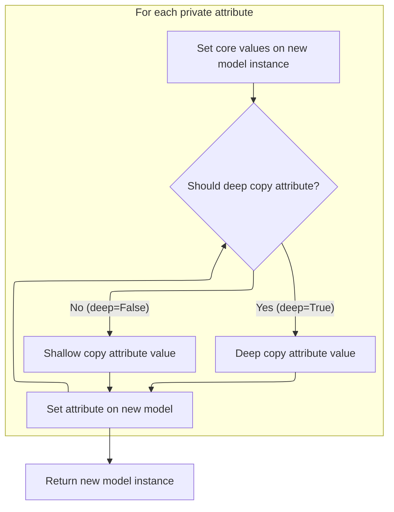

<SwmSnippet path="/pydantic/v1/main.py" line="622">

---

Back in <SwmToken path="pydantic/v1/main.py" pos="615:3:3" line-data="    def _copy_and_set_values(self: &#39;Model&#39;, values: &#39;DictStrAny&#39;, fields_set: &#39;SetStr&#39;, *, deep: bool) -&gt; &#39;Model&#39;:">`_copy_and_set_values`</SwmToken>, after getting the new instance from <SwmToken path="pydantic/v1/main.py" pos="123:3:3" line-data="    def __new__(mcs, name, bases, namespace, **kwargs):  # noqa C901">`__new__`</SwmToken>, we set its <SwmToken path="pydantic/v1/main.py" pos="622:7:7" line-data="        object_setattr(m, &#39;__dict__&#39;, values)">`__dict__`</SwmToken> and <SwmToken path="pydantic/v1/main.py" pos="623:7:7" line-data="        object_setattr(m, &#39;__fields_set__&#39;, fields_set)">`__fields_set__`</SwmToken> directly using <SwmToken path="pydantic/v1/main.py" pos="622:1:1" line-data="        object_setattr(m, &#39;__dict__&#39;, values)">`object_setattr`</SwmToken>. Then we copy over any private attributes, deep copying if needed. This keeps the new instance's state in sync with the original.

```python
        object_setattr(m, '__dict__', values)
        object_setattr(m, '__fields_set__', fields_set)
        for name in self.__private_attributes__:
            value = getattr(self, name, Undefined)
            if value is not Undefined:
                if deep:
                    value = deepcopy(value)
                object_setattr(m, name, value)
```

---

</SwmSnippet>

<SwmSnippet path="/pydantic/v1/main.py" line="629">

---

After copying all the fields and private attributes, <SwmToken path="pydantic/v1/main.py" pos="615:3:3" line-data="    def _copy_and_set_values(self: &#39;Model&#39;, values: &#39;DictStrAny&#39;, fields_set: &#39;SetStr&#39;, *, deep: bool) -&gt; &#39;Model&#39;:">`_copy_and_set_values`</SwmToken> returns the new model instance.

```python
                object_setattr(m, name, value)

        return m
```

---

</SwmSnippet>

### Converting Arbitrary Input to a Model Instance

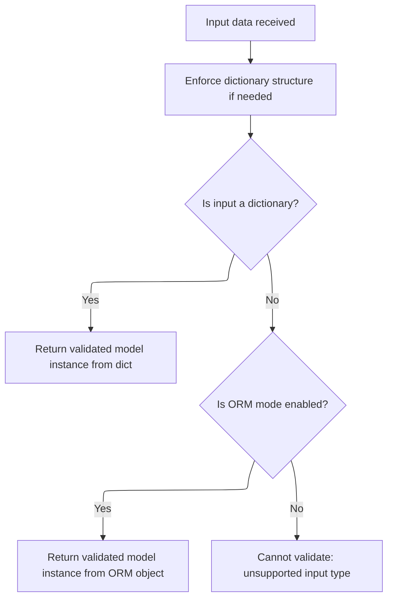

<SwmSnippet path="/pydantic/v1/main.py" line="714">

---

Back in <SwmToken path="pydantic/v1/main.py" pos="689:3:3" line-data="    def validate(cls: Type[&#39;Model&#39;], value: Any) -&gt; &#39;Model&#39;:">`validate`</SwmToken>, if the input isn't already a model instance, we check if it's a dict, use <SwmToken path="pydantic/v1/main.py" pos="719:5:5" line-data="            return cls.from_orm(value)">`from_orm`</SwmToken> if needed, or try to convert it to a dict. This way, we can handle different input types and always end up with a model instance.

```python
        value = cls._enforce_dict_if_root(value)

        if isinstance(value, dict):
            return cls(**value)
        elif cls.__config__.orm_mode:
            return cls.from_orm(value)
        else:
```

---

</SwmSnippet>

### Building a Model from ORM Objects

<SwmSnippet path="/pydantic/v1/main.py" line="578">

---

In <SwmToken path="pydantic/v1/main.py" pos="578:3:3" line-data="    def from_orm(cls: Type[&#39;Model&#39;], obj: Any) -&gt; &#39;Model&#39;:">`from_orm`</SwmToken>, we first check if <SwmToken path="pydantic/v1/main.py" pos="579:9:9" line-data="        if not cls.__config__.orm_mode:">`orm_mode`</SwmToken> is enabled. Then, depending on whether the model uses a custom root type, we either wrap the input or decompose it. After that, we create a new model instance using <SwmToken path="pydantic/v1/main.py" pos="582:7:7" line-data="        m = cls.__new__(cls)">`__new__`</SwmToken>.

```python
    def from_orm(cls: Type['Model'], obj: Any) -> 'Model':
        if not cls.__config__.orm_mode:
            raise ConfigError('You must have the config attribute orm_mode=True to use from_orm')
        obj = {ROOT_KEY: obj} if cls.__custom_root_type__ else cls._decompose_class(obj)
        m = cls.__new__(cls)
```

---

</SwmSnippet>

<SwmSnippet path="/pydantic/v1/main.py" line="583">

---

Back in <SwmToken path="pydantic/v1/main.py" pos="578:3:3" line-data="    def from_orm(cls: Type[&#39;Model&#39;], obj: Any) -&gt; &#39;Model&#39;:">`from_orm`</SwmToken>, after creating the new instance, we call <SwmToken path="pydantic/v1/main.py" pos="583:11:11" line-data="        values, fields_set, validation_error = validate_model(cls, obj)">`validate_model`</SwmToken> to check the input data against the model's schema. This gives us the validated values, fields set, and any errors.

```python
        values, fields_set, validation_error = validate_model(cls, obj)
```

---

</SwmSnippet>

#### Running Model Validation and Collecting Errors

```mermaid
%%{init: {"flowchart": {"defaultRenderer": "elk"}} }%%
flowchart TD
    node1["Start validation with input data and model"] --> node2["Apply pre-validation logic"]
    click node1 openCode "pydantic/v1/main.py:1036:1057"
    click node2 openCode "pydantic/v1/main.py:1052:1056"
    node2 --> node3{"Pre-validation passes?"}
    node3 -->|"Yes"| loop1
    node3 -->|"No"| node15["Return validation error"]
    click node15 openCode "pydantic/v1/main.py:1056:1057"
    subgraph loop1["For each field in the model"]
        node4["Extract and validate field value (consider aliases and config.allow_population_by_field_name)"]
        click node4 openCode "pydantic/v1/main.py:1058:1086"
        node4 --> node5{"Field present and valid?"}
        node5 -->|"Yes"| node6["Store validated value"]
        click node6 openCode "pydantic/v1/main.py:1073:1074"
        node5 -->|"No"| node7["Collect error for field"]
        click node7 openCode "pydantic/v1/main.py:1067:1068"
    end
    loop1 --> node8["Handle extra fields in input (config.extra)"]
    click node8 openCode "pydantic/v1/main.py:1088:1097"
    node8 --> node9{"Extra fields allowed?"}
    node9 -->|"Yes"| node10["Include extra fields"]
    click node10 openCode "pydantic/v1/main.py:1096:1097"
    node9 -->|"No"| node11["Collect error for extra fields"]
    click node11 openCode "pydantic/v1/main.py:1099:1100"
    node10 --> node12["Apply post-validation logic (skip if errors and skip_on_failure)"]
    node11 --> node12
    click node12 openCode "pydantic/v1/main.py:1102:1108"
    node12 --> node13{"Any validation errors?"}
    node13 -->|"No"| node14["Return validated data, fields set, no errors"]
    click node14 openCode "pydantic/v1/main.py:1109:1109"
    node13 -->|"Yes"| node15["Return validation error("s")"]

%% Swimm:
%% %%{init: {"flowchart": {"defaultRenderer": "elk"}} }%%
%% flowchart TD
%%     node1["Start validation with input data and model"] --> node2["Apply pre-validation logic"]
%%     click node1 openCode "<SwmPath>[pydantic/v1/main.py](pydantic/v1/main.py)</SwmPath>:1036:1057"
%%     click node2 openCode "<SwmPath>[pydantic/v1/main.py](pydantic/v1/main.py)</SwmPath>:1052:1056"
%%     node2 --> node3{"Pre-validation passes?"}
%%     node3 -->|"Yes"| loop1
%%     node3 -->|"No"| node15["Return validation error"]
%%     click node15 openCode "<SwmPath>[pydantic/v1/main.py](pydantic/v1/main.py)</SwmPath>:1056:1057"
%%     subgraph loop1["For each field in the model"]
%%         node4["Extract and validate field value (consider aliases and <SwmToken path="pydantic/v1/main.py" pos="1061:11:13" line-data="        if value is _missing and config.allow_population_by_field_name and field.alt_alias:">`config.allow_population_by_field_name`</SwmToken>)"]
%%         click node4 openCode "<SwmPath>[pydantic/v1/main.py](pydantic/v1/main.py)</SwmPath>:1058:1086"
%%         node4 --> node5{"Field present and valid?"}
%%         node5 -->|"Yes"| node6["Store validated value"]
%%         click node6 openCode "<SwmPath>[pydantic/v1/main.py](pydantic/v1/main.py)</SwmPath>:1073:1074"
%%         node5 -->|"No"| node7["Collect error for field"]
%%         click node7 openCode "<SwmPath>[pydantic/v1/main.py](pydantic/v1/main.py)</SwmPath>:1067:1068"
%%     end
%%     loop1 --> node8["Handle extra fields in input (<SwmToken path="pydantic/v1/main.py" pos="1049:5:7" line-data="    check_extra = config.extra is not Extra.ignore">`config.extra`</SwmToken>)"]
%%     click node8 openCode "<SwmPath>[pydantic/v1/main.py](pydantic/v1/main.py)</SwmPath>:1088:1097"
%%     node8 --> node9{"Extra fields allowed?"}
%%     node9 -->|"Yes"| node10["Include extra fields"]
%%     click node10 openCode "<SwmPath>[pydantic/v1/main.py](pydantic/v1/main.py)</SwmPath>:1096:1097"
%%     node9 -->|"No"| node11["Collect error for extra fields"]
%%     click node11 openCode "<SwmPath>[pydantic/v1/main.py](pydantic/v1/main.py)</SwmPath>:1099:1100"
%%     node10 --> node12["Apply post-validation logic (skip if errors and <SwmToken path="pydantic/v1/main.py" pos="1102:3:3" line-data="    for skip_on_failure, validator in model.__post_root_validators__:">`skip_on_failure`</SwmToken>)"]
%%     node11 --> node12
%%     click node12 openCode "<SwmPath>[pydantic/v1/main.py](pydantic/v1/main.py)</SwmPath>:1102:1108"
%%     node12 --> node13{"Any validation errors?"}
%%     node13 -->|"No"| node14["Return validated data, fields set, no errors"]
%%     click node14 openCode "<SwmPath>[pydantic/v1/main.py](pydantic/v1/main.py)</SwmPath>:1109:1109"
%%     node13 -->|"Yes"| node15["Return validation error("s")"]
```

<SwmSnippet path="/pydantic/v1/main.py" line="1036">

---

In <SwmToken path="pydantic/v1/main.py" pos="1036:2:2" line-data="def validate_model(  # noqa: C901 (ignore complexity)">`validate_model`</SwmToken>, we start by running pre-root validators on the input, then validate each field, handle missing or extra fields, and finally run post-root validators. This covers the whole validation lifecycle for a model.

```python
def validate_model(  # noqa: C901 (ignore complexity)
    model: Type[BaseModel], input_data: 'DictStrAny', cls: 'ModelOrDc' = None
) -> Tuple['DictStrAny', 'SetStr', Optional[ValidationError]]:
    """
    validate data against a model.
    """
    values = {}
    errors = []
    # input_data names, possibly alias
    names_used = set()
    # field names, never aliases
    fields_set = set()
    config = model.__config__
    check_extra = config.extra is not Extra.ignore
    cls_ = cls or model

    for validator in model.__pre_root_validators__:
        try:
            input_data = validator(cls_, input_data)
        except (ValueError, TypeError, AssertionError) as exc:
            return {}, set(), ValidationError([ErrorWrapper(exc, loc=ROOT_KEY)], cls_)
```

---

</SwmSnippet>

<SwmSnippet path="/pydantic/v1/main.py" line="1058">

---

For each field, we try to get its value from the input using the alias first, then the field name if allowed. This way, users can use either name when providing data. We then validate the value and collect any errors.

```python
    for name, field in model.__fields__.items():
        value = input_data.get(field.alias, _missing)
        using_name = False
        if value is _missing and config.allow_population_by_field_name and field.alt_alias:
            value = input_data.get(field.name, _missing)
            using_name = True

        if value is _missing:
            if field.required:
                errors.append(ErrorWrapper(MissingError(), loc=field.alias))
                continue

            value = field.get_default()

            if not config.validate_all and not field.validate_always:
                values[name] = value
                continue
        else:
            fields_set.add(name)
            if check_extra:
                names_used.add(field.name if using_name else field.alias)

        v_, errors_ = field.validate(value, values, loc=field.alias, cls=cls_)
        if isinstance(errors_, ErrorWrapper):
            errors.append(errors_)
        elif isinstance(errors_, list):
            errors.extend(errors_)
        else:
            values[name] = v_

```

---

</SwmSnippet>

<SwmSnippet path="/pydantic/v1/main.py" line="1088">

---

After validating all fields, <SwmToken path="pydantic/v1/main.py" pos="583:11:11" line-data="        values, fields_set, validation_error = validate_model(cls, obj)">`validate_model`</SwmToken> checks for any extra fields in the input. Depending on config, these are either added, ignored, or flagged as errors.

```python
    if check_extra:
        if isinstance(input_data, GetterDict):
            extra = input_data.extra_keys() - names_used
        else:
            extra = input_data.keys() - names_used
        if extra:
            fields_set |= extra
            if config.extra is Extra.allow:
                for f in extra:
                    values[f] = input_data[f]
```

---

</SwmSnippet>

<SwmSnippet path="/pydantic/v1/main.py" line="1097">

---

After all validation and error handling, <SwmToken path="pydantic/v1/main.py" pos="583:11:11" line-data="        values, fields_set, validation_error = validate_model(cls, obj)">`validate_model`</SwmToken> returns the validated values, which fields were set, and any errors found.

```python
                    values[f] = input_data[f]
            else:
                for f in sorted(extra):
                    errors.append(ErrorWrapper(ExtraError(), loc=f))

    for skip_on_failure, validator in model.__post_root_validators__:
        if skip_on_failure and errors:
            continue
        try:
            values = validator(cls_, values)
        except (ValueError, TypeError, AssertionError) as exc:
            errors.append(ErrorWrapper(exc, loc=ROOT_KEY))
```

---

</SwmSnippet>

#### Finalizing the Model Instance from ORM Data

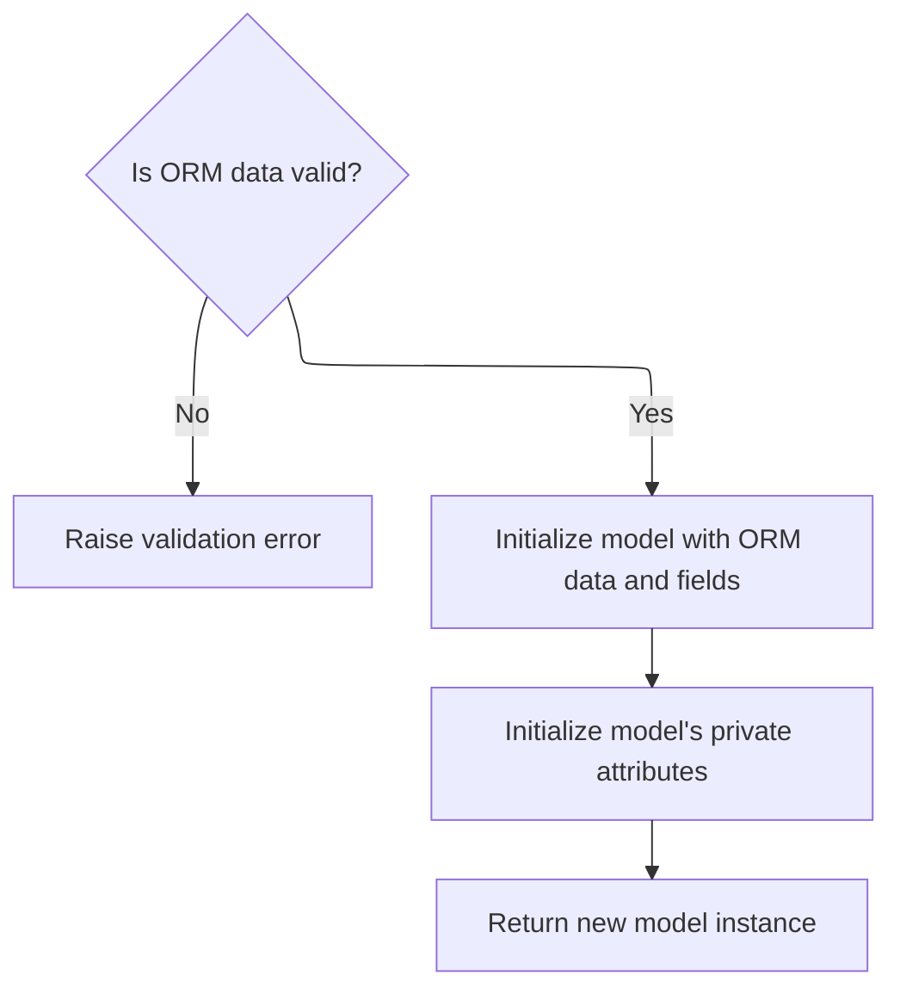

<SwmSnippet path="/pydantic/v1/main.py" line="584">

---

After <SwmToken path="pydantic/v1/main.py" pos="583:11:11" line-data="        values, fields_set, validation_error = validate_model(cls, obj)">`validate_model`</SwmToken> in <SwmToken path="pydantic/v1/main.py" pos="578:3:3" line-data="    def from_orm(cls: Type[&#39;Model&#39;], obj: Any) -&gt; &#39;Model&#39;:">`from_orm`</SwmToken>, we set the instance's <SwmToken path="pydantic/v1/main.py" pos="586:7:7" line-data="        object_setattr(m, &#39;__dict__&#39;, values)">`__dict__`</SwmToken> and <SwmToken path="pydantic/v1/main.py" pos="587:7:7" line-data="        object_setattr(m, &#39;__fields_set__&#39;, fields_set)">`__fields_set__`</SwmToken> directly, then call <SwmToken path="pydantic/v1/main.py" pos="588:3:3" line-data="        m._init_private_attributes()">`_init_private_attributes`</SwmToken> to finish setup. If there was a validation error, we raise it.

```python
        if validation_error:
            raise validation_error
        object_setattr(m, '__dict__', values)
        object_setattr(m, '__fields_set__', fields_set)
        m._init_private_attributes()
        return m
```

---

</SwmSnippet>

### Handling Non-ORM, Non-Dict Input in Validation

<SwmSnippet path="/pydantic/v1/main.py" line="721">

---

After trying <SwmToken path="pydantic/v1/main.py" pos="578:3:3" line-data="    def from_orm(cls: Type[&#39;Model&#39;], obj: Any) -&gt; &#39;Model&#39;:">`from_orm`</SwmToken>, if the input isn't a dict, we try to convert it using dict(value). If that fails, we raise an error. This is the last step in <SwmToken path="pydantic/v1/main.py" pos="689:3:3" line-data="    def validate(cls: Type[&#39;Model&#39;], value: Any) -&gt; &#39;Model&#39;:">`validate`</SwmToken> to handle arbitrary input types.

```python
            try:
                value_as_dict = dict(value)
            except (TypeError, ValueError) as e:
                raise DictError() from e
            return cls(**value_as_dict)
```

---

</SwmSnippet>

## Serializing the Model to a Dictionary

<SwmSnippet path="/pydantic/v1/main.py" line="433">

---

<SwmToken path="pydantic/v1/main.py" pos="433:3:3" line-data="    def dict(">`dict`</SwmToken> builds a dictionary representation of the model, using <SwmToken path="pydantic/v1/main.py" pos="456:3:3" line-data="            self._iter(">`_iter`</SwmToken> to filter and format the fields based on the given options. This lets you control which fields are included and how they're named.

```python
    def dict(
        self,
        *,
        include: Optional[Union['AbstractSetIntStr', 'MappingIntStrAny']] = None,
        exclude: Optional[Union['AbstractSetIntStr', 'MappingIntStrAny']] = None,
        by_alias: bool = False,
        skip_defaults: Optional[bool] = None,
        exclude_unset: bool = False,
        exclude_defaults: bool = False,
        exclude_none: bool = False,
    ) -> 'DictStrAny':
        """
        Generate a dictionary representation of the model, optionally specifying which fields to include or exclude.

        """
        if skip_defaults is not None:
            warnings.warn(
                f'{self.__class__.__name__}.dict(): "skip_defaults" is deprecated and replaced by "exclude_unset"',
                DeprecationWarning,
            )
            exclude_unset = skip_defaults

        return dict(
            self._iter(
                to_dict=True,
                by_alias=by_alias,
                include=include,
                exclude=exclude,
                exclude_unset=exclude_unset,
                exclude_defaults=exclude_defaults,
                exclude_none=exclude_none,
            )
        )
```

---

</SwmSnippet>

## Iterating Over Model Fields for Serialization

```mermaid
%%{init: {"flowchart": {"defaultRenderer": "elk"}} }%%
flowchart TD
    node1["Set up which fields to include or exclude based on user/model rules"]
    click node1 openCode "pydantic/v1/main.py:828:848"
    node1 --> node2["Decide which fields are allowed in the output"]
    click node2 openCode "pydantic/v1/main.py:846:848"
    node2 --> loop1
    subgraph loop1["For each field in the model"]
      node3["Is the field included and not excluded by preferences? (e.g., exclude_none, exclude_defaults)"]
      click node3 openCode "pydantic/v1/main.py:857:864"
      node3 -->|"Yes"| node4["Transform value if needed (to_dict, alias, etc.)"]
      click node4 openCode "pydantic/v1/main.py:872:881"
      node4 --> node5["Output the field name and value as specified"]
      click node5 openCode "pydantic/v1/main.py:882:882"
    end


subgraph node2 [_calculate_keys]
  sgmain_1_node1{"Are include/exclude rules provided or exclude_unset True?"}
  click sgmain_1_node1 openCode "pydantic/v1/main.py:891:892"
  sgmain_1_node1 -->|"No"| sgmain_1_node3["Return None (no filtering needed)"]
  click sgmain_1_node3 openCode "pydantic/v1/main.py:892:892"
  sgmain_1_node1 -->|"Yes"| sgmain_1_node2["Choose initial fields (explicitly set if exclude_unset, else all fields), then apply include/exclude/update rules"]
  click sgmain_1_node2 openCode "pydantic/v1/main.py:895:909"
  sgmain_1_node2 --> sgmain_1_node3
end

%% Swimm:
%% %%{init: {"flowchart": {"defaultRenderer": "elk"}} }%%
%% flowchart TD
%%     node1["Set up which fields to include or exclude based on user/model rules"]
%%     click node1 openCode "<SwmPath>[pydantic/v1/main.py](pydantic/v1/main.py)</SwmPath>:828:848"
%%     node1 --> node2["Decide which fields are allowed in the output"]
%%     click node2 openCode "<SwmPath>[pydantic/v1/main.py](pydantic/v1/main.py)</SwmPath>:846:848"
%%     node2 --> loop1
%%     subgraph loop1["For each field in the model"]
%%       node3["Is the field included and not excluded by preferences? (<SwmToken path="pydantic/v1/main.py" pos="295:16:18" line-data="        # for attributes not in `new_namespace` (e.g. private attributes)">`e.g`</SwmToken>., <SwmToken path="pydantic/v1/main.py" pos="442:1:1" line-data="        exclude_none: bool = False,">`exclude_none`</SwmToken>, <SwmToken path="pydantic/v1/main.py" pos="441:1:1" line-data="        exclude_defaults: bool = False,">`exclude_defaults`</SwmToken>)"]
%%       click node3 openCode "<SwmPath>[pydantic/v1/main.py](pydantic/v1/main.py)</SwmPath>:857:864"
%%       node3 -->|"Yes"| node4["Transform value if needed (<SwmToken path="pydantic/v1/main.py" pos="457:1:1" line-data="                to_dict=True,">`to_dict`</SwmToken>, alias, etc.)"]
%%       click node4 openCode "<SwmPath>[pydantic/v1/main.py](pydantic/v1/main.py)</SwmPath>:872:881"
%%       node4 --> node5["Output the field name and value as specified"]
%%       click node5 openCode "<SwmPath>[pydantic/v1/main.py](pydantic/v1/main.py)</SwmPath>:882:882"
%%     end
%% 
%% 
%% subgraph node2 [<SwmToken path="pydantic/v1/main.py" pos="846:7:7" line-data="        allowed_keys = self._calculate_keys(">`_calculate_keys`</SwmToken>]
%%   sgmain_1_node1{"Are include/exclude rules provided or <SwmToken path="pydantic/v1/main.py" pos="440:1:1" line-data="        exclude_unset: bool = False,">`exclude_unset`</SwmToken> True?"}
%%   click sgmain_1_node1 openCode "<SwmPath>[pydantic/v1/main.py](pydantic/v1/main.py)</SwmPath>:891:892"
%%   sgmain_1_node1 -->|"No"| sgmain_1_node3["Return None (no filtering needed)"]
%%   click sgmain_1_node3 openCode "<SwmPath>[pydantic/v1/main.py](pydantic/v1/main.py)</SwmPath>:892:892"
%%   sgmain_1_node1 -->|"Yes"| sgmain_1_node2["Choose initial fields (explicitly set if <SwmToken path="pydantic/v1/main.py" pos="440:1:1" line-data="        exclude_unset: bool = False,">`exclude_unset`</SwmToken>, else all fields), then apply include/exclude/update rules"]
%%   click sgmain_1_node2 openCode "<SwmPath>[pydantic/v1/main.py](pydantic/v1/main.py)</SwmPath>:895:909"
%%   sgmain_1_node2 --> sgmain_1_node3
%% end
```

<SwmSnippet path="/pydantic/v1/main.py" line="828">

---

In <SwmToken path="pydantic/v1/main.py" pos="828:3:3" line-data="    def _iter(">`_iter`</SwmToken>, we merge any include/exclude options and then call <SwmToken path="pydantic/v1/main.py" pos="846:7:7" line-data="        allowed_keys = self._calculate_keys(">`_calculate_keys`</SwmToken> to figure out which fields to include in the output. This sets up the actual iteration over the model's data.

```python
    def _iter(
        self,
        to_dict: bool = False,
        by_alias: bool = False,
        include: Optional[Union['AbstractSetIntStr', 'MappingIntStrAny']] = None,
        exclude: Optional[Union['AbstractSetIntStr', 'MappingIntStrAny']] = None,
        exclude_unset: bool = False,
        exclude_defaults: bool = False,
        exclude_none: bool = False,
    ) -> 'TupleGenerator':
        # Merge field set excludes with explicit exclude parameter with explicit overriding field set options.
        # The extra "is not None" guards are not logically necessary but optimizes performance for the simple case.
        if exclude is not None or self.__exclude_fields__ is not None:
            exclude = ValueItems.merge(self.__exclude_fields__, exclude)

        if include is not None or self.__include_fields__ is not None:
            include = ValueItems.merge(self.__include_fields__, include, intersect=True)

        allowed_keys = self._calculate_keys(
            include=include, exclude=exclude, exclude_unset=exclude_unset  # type: ignore
        )
```

---

</SwmSnippet>

### Filtering Model Fields for Output

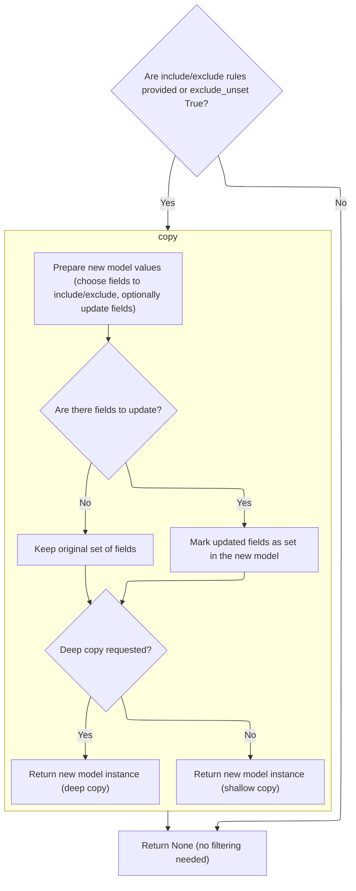

<SwmSnippet path="/pydantic/v1/main.py" line="884">

---

In <SwmToken path="pydantic/v1/main.py" pos="884:3:3" line-data="    def _calculate_keys(">`_calculate_keys`</SwmToken>, we decide which fields to include based on include/exclude options and whether <SwmToken path="pydantic/v1/main.py" pos="888:1:1" line-data="        exclude_unset: bool,">`exclude_unset`</SwmToken> is set. We use either <SwmToken path="pydantic/v1/main.py" pos="896:7:7" line-data="            keys = self.__fields_set__.copy()">`__fields_set__`</SwmToken> or <SwmToken path="pydantic/v1/main.py" pos="898:7:11" line-data="            keys = self.__dict__.keys()">`__dict__.keys()`</SwmToken> as the base, then filter as needed. Next, we call <SwmToken path="pydantic/v1/main.py" pos="896:9:9" line-data="            keys = self.__fields_set__.copy()">`copy`</SwmToken> to actually duplicate the model with the selected fields.

```python
    def _calculate_keys(
        self,
        include: Optional['MappingIntStrAny'],
        exclude: Optional['MappingIntStrAny'],
        exclude_unset: bool,
        update: Optional['DictStrAny'] = None,
    ) -> Optional[AbstractSet[str]]:
        if include is None and exclude is None and exclude_unset is False:
            return None

        keys: AbstractSet[str]
        if exclude_unset:
            keys = self.__fields_set__.copy()
        else:
            keys = self.__dict__.keys()

```

---

</SwmSnippet>

#### Duplicating the Model with Field Selection

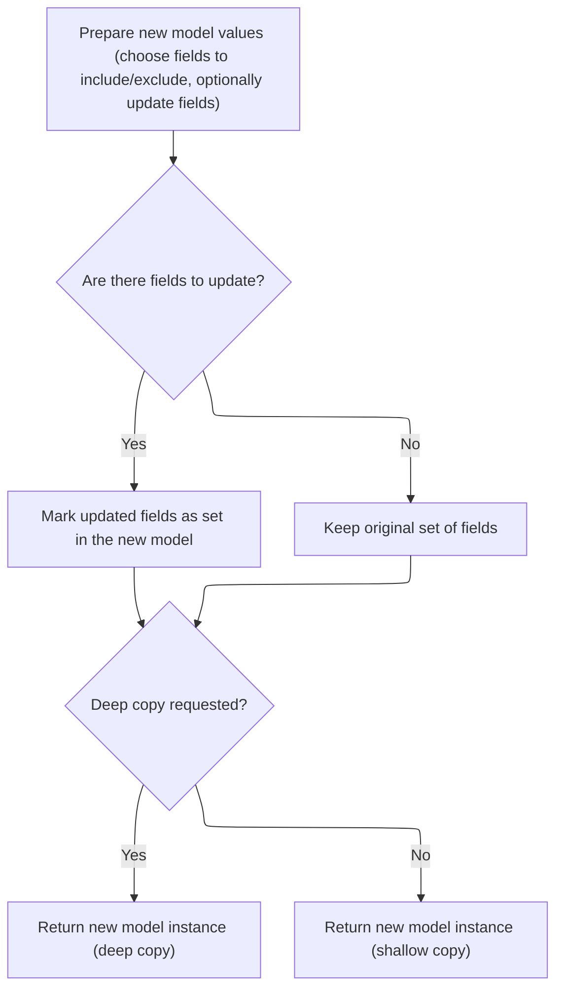

<SwmSnippet path="/pydantic/v1/main.py" line="633">

---

In <SwmToken path="pydantic/v1/main.py" pos="633:3:3" line-data="    def copy(">`copy`</SwmToken>, we use <SwmToken path="pydantic/v1/main.py" pos="653:3:3" line-data="            self._iter(to_dict=False, by_alias=False, include=include, exclude=exclude, exclude_unset=False),">`_iter`</SwmToken> to get the current field values, filtered by include/exclude if given. This sets up the data for the new model instance.

```python
    def copy(
        self: 'Model',
        *,
        include: Optional[Union['AbstractSetIntStr', 'MappingIntStrAny']] = None,
        exclude: Optional[Union['AbstractSetIntStr', 'MappingIntStrAny']] = None,
        update: Optional['DictStrAny'] = None,
        deep: bool = False,
    ) -> 'Model':
        """
        Duplicate a model, optionally choose which fields to include, exclude and change.

        :param include: fields to include in new model
        :param exclude: fields to exclude from new model, as with values this takes precedence over include
        :param update: values to change/add in the new model. Note: the data is not validated before creating
            the new model: you should trust this data
        :param deep: set to `True` to make a deep copy of the model
        :return: new model instance
        """

        values = dict(
            self._iter(to_dict=False, by_alias=False, include=include, exclude=exclude, exclude_unset=False),
```

---

</SwmSnippet>

<SwmSnippet path="/pydantic/v1/main.py" line="652">

---

After <SwmToken path="pydantic/v1/main.py" pos="653:3:3" line-data="            self._iter(to_dict=False, by_alias=False, include=include, exclude=exclude, exclude_unset=False),">`_iter`</SwmToken> in <SwmToken path="pydantic/v1/main.py" pos="633:3:3" line-data="    def copy(">`copy`</SwmToken>, we merge the field values with any updates provided. This way, the new instance can have changes applied right away.

```python
        values = dict(
            self._iter(to_dict=False, by_alias=False, include=include, exclude=exclude, exclude_unset=False),
            **(update or {}),
        )

```

---

</SwmSnippet>

<SwmSnippet path="/pydantic/v1/main.py" line="657">

---

After merging values and updates in <SwmToken path="pydantic/v1/main.py" pos="633:3:3" line-data="    def copy(">`copy`</SwmToken>, we update the set of fields that are considered set, then call <SwmToken path="pydantic/v1/main.py" pos="663:5:5" line-data="        return self._copy_and_set_values(values, fields_set, deep=deep)">`_copy_and_set_values`</SwmToken> to actually build the new model instance.

```python
        # new `__fields_set__` can have unset optional fields with a set value in `update` kwarg
        if update:
            fields_set = self.__fields_set__ | update.keys()
        else:
            fields_set = set(self.__fields_set__)

        return self._copy_and_set_values(values, fields_set, deep=deep)
```

---

</SwmSnippet>

#### Finalizing the Set of Keys for Output

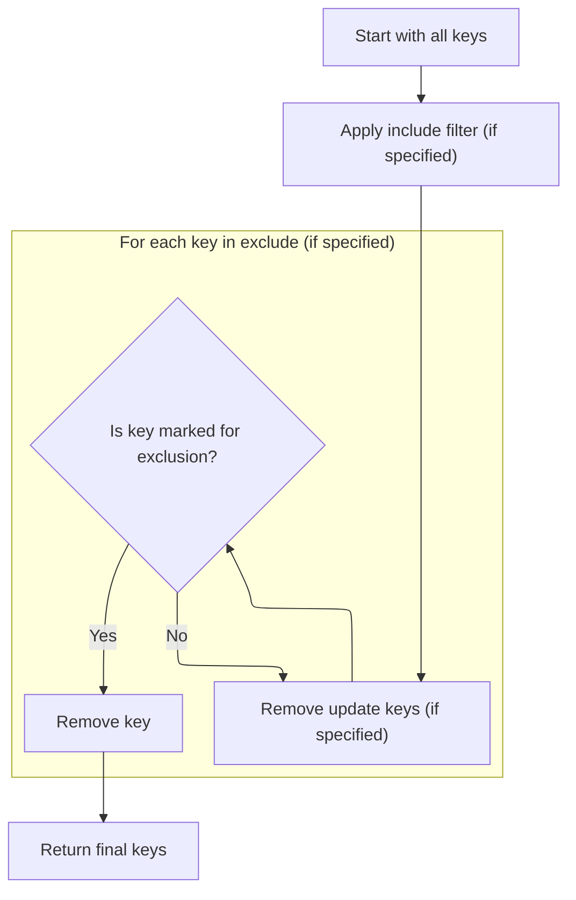

<SwmSnippet path="/pydantic/v1/main.py" line="900">

---

After copying, <SwmToken path="pydantic/v1/main.py" pos="846:7:7" line-data="        allowed_keys = self._calculate_keys(">`_calculate_keys`</SwmToken> does the final filtering of keys, using <SwmToken path="pydantic/v1/main.py" pos="907:25:27" line-data="            keys -= {k for k, v in exclude.items() if ValueItems.is_true(v)}">`ValueItems.is_true`</SwmToken> to decide which ones to exclude. The result is the set of keys that will be included in the output.

```python
        if include is not None:
            keys &= include.keys()

        if update:
            keys -= update.keys()

        if exclude:
            keys -= {k for k, v in exclude.items() if ValueItems.is_true(v)}

        return keys
```

---

</SwmSnippet>

### Filtering and Preparing Field Values for Output

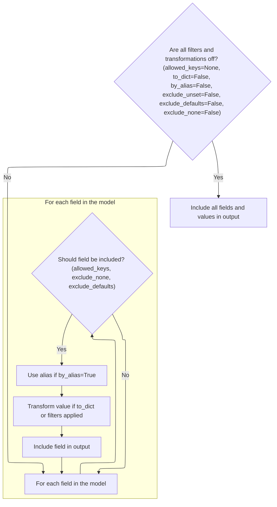

<SwmSnippet path="/pydantic/v1/main.py" line="849">

---

After getting <SwmToken path="pydantic/v1/main.py" pos="849:3:3" line-data="        if allowed_keys is None and not (to_dict or by_alias or exclude_unset or exclude_defaults or exclude_none):">`allowed_keys`</SwmToken> from <SwmToken path="pydantic/v1/main.py" pos="846:7:7" line-data="        allowed_keys = self._calculate_keys(">`_calculate_keys`</SwmToken>, \_iter loops through the model's fields, skipping any that shouldn't be included (like those filtered out or set to None when <SwmToken path="pydantic/v1/main.py" pos="849:30:30" line-data="        if allowed_keys is None and not (to_dict or by_alias or exclude_unset or exclude_defaults or exclude_none):">`exclude_none`</SwmToken> is on). For each field that passes, we use <SwmToken path="pydantic/v1/main.py" pos="872:7:7" line-data="                v = self._get_value(">`_get_value`</SwmToken> to handle any nested models, filtering, or formatting before yielding the result. This makes sure the output is properly filtered and formatted, not just a raw dump of **dict**.

```python
        if allowed_keys is None and not (to_dict or by_alias or exclude_unset or exclude_defaults or exclude_none):
            # huge boost for plain _iter()
            yield from self.__dict__.items()
            return

        value_exclude = ValueItems(self, exclude) if exclude is not None else None
        value_include = ValueItems(self, include) if include is not None else None

        for field_key, v in self.__dict__.items():
            if (allowed_keys is not None and field_key not in allowed_keys) or (exclude_none and v is None):
                continue

            if exclude_defaults:
                model_field = self.__fields__.get(field_key)
                if not getattr(model_field, 'required', True) and getattr(model_field, 'default', _missing) == v:
                    continue

            if by_alias and field_key in self.__fields__:
                dict_key = self.__fields__[field_key].alias
            else:
                dict_key = field_key

            if to_dict or value_include or value_exclude:
                v = self._get_value(
                    v,
                    to_dict=to_dict,
                    by_alias=by_alias,
                    include=value_include and value_include.for_element(field_key),
                    exclude=value_exclude and value_exclude.for_element(field_key),
                    exclude_unset=exclude_unset,
                    exclude_defaults=exclude_defaults,
                    exclude_none=exclude_none,
                )
```

---

</SwmSnippet>

### Recursively Filtering and Serializing Field Values

```mermaid
%%{init: {"flowchart": {"defaultRenderer": "elk"}} }%%
flowchart TD
    node1{"What type is the value?"}
    click node1 openCode "pydantic/v1/main.py:746:805"
    node1 -->|"Pydantic model"| node2["Transform model for export (dict or copy), using to_dict, include, exclude, and related rules"]
    click node2 openCode "pydantic/v1/main.py:746:760"
    node1 -->|"Dictionary"| loop1
    node1 -->|"Sequence"| loop2
    node1 -->|"Enum & use_enum_values"| node5["Return Enum value"]
    click node5 openCode "pydantic/v1/main.py:801:802"
    node1 -->|"Other"| node6["Return value as-is"]
    click node6 openCode "pydantic/v1/main.py:804:805"

    subgraph loop1["For each key-value in dictionary"]
      node3["Recursively transform value, applying include/exclude rules"]
      click node3 openCode "pydantic/v1/main.py:765:780"
    end
    loop1 --> node7["Assemble transformed dictionary"]
    click node7 openCode "pydantic/v1/main.py:766:781"

    subgraph loop2["For each element in sequence"]
      node4["Recursively transform element, applying include/exclude rules"]
      click node4 openCode "pydantic/v1/main.py:782:797"
    end
    loop2 --> node8["Assemble transformed sequence"]
    click node8 openCode "pydantic/v1/main.py:799:800"

%% Swimm:
%% %%{init: {"flowchart": {"defaultRenderer": "elk"}} }%%
%% flowchart TD
%%     node1{"What type is the value?"}
%%     click node1 openCode "<SwmPath>[pydantic/v1/main.py](pydantic/v1/main.py)</SwmPath>:746:805"
%%     node1 -->|"Pydantic model"| node2["Transform model for export (dict or copy), using <SwmToken path="pydantic/v1/main.py" pos="457:1:1" line-data="                to_dict=True,">`to_dict`</SwmToken>, include, exclude, and related rules"]
%%     click node2 openCode "<SwmPath>[pydantic/v1/main.py](pydantic/v1/main.py)</SwmPath>:746:760"
%%     node1 -->|"Dictionary"| loop1
%%     node1 -->|"Sequence"| loop2
%%     node1 -->|"Enum & <SwmToken path="pydantic/v1/main.py" pos="801:21:21" line-data="        elif isinstance(v, Enum) and getattr(cls.Config, &#39;use_enum_values&#39;, False):">`use_enum_values`</SwmToken>"| node5["Return Enum value"]
%%     click node5 openCode "<SwmPath>[pydantic/v1/main.py](pydantic/v1/main.py)</SwmPath>:801:802"
%%     node1 -->|"Other"| node6["Return value as-is"]
%%     click node6 openCode "<SwmPath>[pydantic/v1/main.py](pydantic/v1/main.py)</SwmPath>:804:805"
%% 
%%     subgraph loop1["For each key-value in dictionary"]
%%       node3["Recursively transform value, applying include/exclude rules"]
%%       click node3 openCode "<SwmPath>[pydantic/v1/main.py](pydantic/v1/main.py)</SwmPath>:765:780"
%%     end
%%     loop1 --> node7["Assemble transformed dictionary"]
%%     click node7 openCode "<SwmPath>[pydantic/v1/main.py](pydantic/v1/main.py)</SwmPath>:766:781"
%% 
%%     subgraph loop2["For each element in sequence"]
%%       node4["Recursively transform element, applying include/exclude rules"]
%%       click node4 openCode "<SwmPath>[pydantic/v1/main.py](pydantic/v1/main.py)</SwmPath>:782:797"
%%     end
%%     loop2 --> node8["Assemble transformed sequence"]
%%     click node8 openCode "<SwmPath>[pydantic/v1/main.py](pydantic/v1/main.py)</SwmPath>:799:800"
```

<SwmSnippet path="/pydantic/v1/main.py" line="735">

---

In <SwmToken path="pydantic/v1/main.py" pos="735:3:3" line-data="    def _get_value(">`_get_value`</SwmToken>, when we hit a <SwmToken path="pydantic/v1/main.py" pos="746:8:8" line-data="        if isinstance(v, BaseModel):">`BaseModel`</SwmToken> instance and <SwmToken path="pydantic/v1/main.py" pos="738:1:1" line-data="        to_dict: bool,">`to_dict`</SwmToken> is set, we call its dict method with all the filtering options. If the resulting dict has <SwmToken path="pydantic/v1/main.py" pos="756:3:3" line-data="                if ROOT_KEY in v_dict:">`ROOT_KEY`</SwmToken>, we return just that value (for custom root types); otherwise, we return the whole dict. This handles nested models and custom root serialization cleanly.

```python
    def _get_value(
        cls,
        v: Any,
        to_dict: bool,
        by_alias: bool,
        include: Optional[Union['AbstractSetIntStr', 'MappingIntStrAny']],
        exclude: Optional[Union['AbstractSetIntStr', 'MappingIntStrAny']],
        exclude_unset: bool,
        exclude_defaults: bool,
        exclude_none: bool,
    ) -> Any:
        if isinstance(v, BaseModel):
            if to_dict:
                v_dict = v.dict(
                    by_alias=by_alias,
                    exclude_unset=exclude_unset,
                    exclude_defaults=exclude_defaults,
                    include=include,
                    exclude=exclude,
                    exclude_none=exclude_none,
                )
                if ROOT_KEY in v_dict:
                    return v_dict[ROOT_KEY]
                return v_dict
            else:
```

---

</SwmSnippet>

<SwmSnippet path="/pydantic/v1/main.py" line="760">

---

After handling the dict case for <SwmToken path="pydantic/v1/main.py" pos="137:12:12" line-data="            if _is_base_model_class_defined and issubclass(base, BaseModel) and base != BaseModel:">`BaseModel`</SwmToken> in <SwmToken path="pydantic/v1/main.py" pos="735:3:3" line-data="    def _get_value(">`_get_value`</SwmToken>, if <SwmToken path="pydantic/v1/main.py" pos="457:1:1" line-data="                to_dict=True,">`to_dict`</SwmToken> isn't set, we call copy with include/exclude filters. This gives us a filtered model instance instead of a dict, which is useful when we want to keep working with models, not plain data.

```python
                return v.copy(include=include, exclude=exclude)

```

---

</SwmSnippet>

<SwmSnippet path="/pydantic/v1/main.py" line="762">

---

After handling <SwmToken path="pydantic/v1/main.py" pos="137:12:12" line-data="            if _is_base_model_class_defined and issubclass(base, BaseModel) and base != BaseModel:">`BaseModel`</SwmToken> and copy in <SwmToken path="pydantic/v1/main.py" pos="767:6:6" line-data="                k_: cls._get_value(">`_get_value`</SwmToken>, the function uses <SwmToken path="pydantic/v1/main.py" pos="762:5:5" line-data="        value_exclude = ValueItems(v, exclude) if exclude else None">`ValueItems`</SwmToken> to apply include/exclude filters recursively to dicts and sequences. It processes each item or element, calling itself for nested values, and handles Enums with <SwmToken path="pydantic/v1/main.py" pos="801:21:21" line-data="        elif isinstance(v, Enum) and getattr(cls.Config, &#39;use_enum_values&#39;, False):">`use_enum_values`</SwmToken> if set. If none of those cases match, it just returns the value as is.

```python
        value_exclude = ValueItems(v, exclude) if exclude else None
        value_include = ValueItems(v, include) if include else None

        if isinstance(v, dict):
            return {
                k_: cls._get_value(
                    v_,
                    to_dict=to_dict,
                    by_alias=by_alias,
                    exclude_unset=exclude_unset,
                    exclude_defaults=exclude_defaults,
                    include=value_include and value_include.for_element(k_),
                    exclude=value_exclude and value_exclude.for_element(k_),
                    exclude_none=exclude_none,
                )
                for k_, v_ in v.items()
                if (not value_exclude or not value_exclude.is_excluded(k_))
                and (not value_include or value_include.is_included(k_))
            }

        elif sequence_like(v):
            seq_args = (
                cls._get_value(
                    v_,
                    to_dict=to_dict,
                    by_alias=by_alias,
                    exclude_unset=exclude_unset,
                    exclude_defaults=exclude_defaults,
                    include=value_include and value_include.for_element(i),
                    exclude=value_exclude and value_exclude.for_element(i),
                    exclude_none=exclude_none,
                )
                for i, v_ in enumerate(v)
                if (not value_exclude or not value_exclude.is_excluded(i))
                and (not value_include or value_include.is_included(i))
            )

            return v.__class__(*seq_args) if is_namedtuple(v.__class__) else v.__class__(seq_args)

        elif isinstance(v, Enum) and getattr(cls.Config, 'use_enum_values', False):
            return v.value

        else:
            return v
```

---

</SwmSnippet>

### Yielding the Final Filtered Key/Value Pairs

<SwmSnippet path="/pydantic/v1/main.py" line="882">

---

After <SwmToken path="pydantic/v1/main.py" pos="735:3:3" line-data="    def _get_value(">`_get_value`</SwmToken>, \_iter yields each filtered key/value pair for the caller to use.

```python
            yield dict_key, v
```

---

</SwmSnippet>

&nbsp;

*This is an auto-generated document by Swimm 🌊 and has not yet been verified by a human*

<SwmMeta version="3.0.0" repo-id="Z2l0aHViJTNBJTNBcHlkYW50aWMlM0ElM0FTd2ltbS1EZW1v" repo-name="pydantic"><sup>Powered by [Swimm](/)</sup></SwmMeta>
